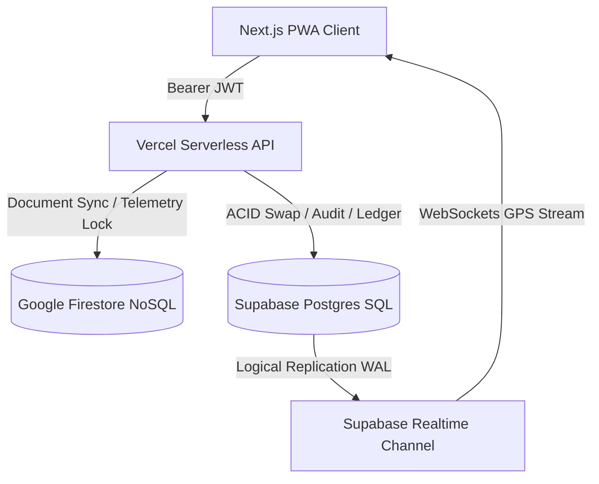
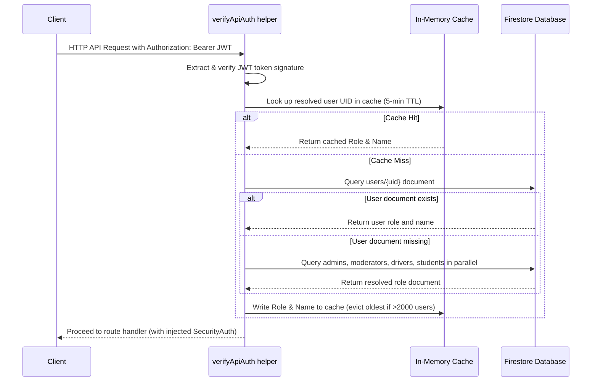
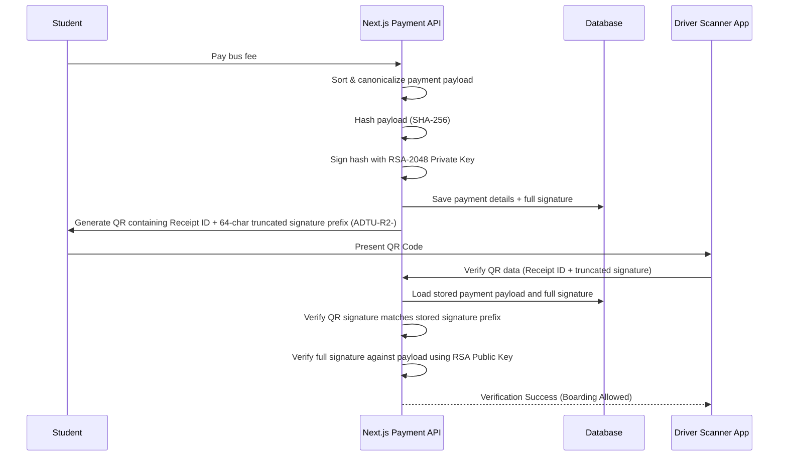
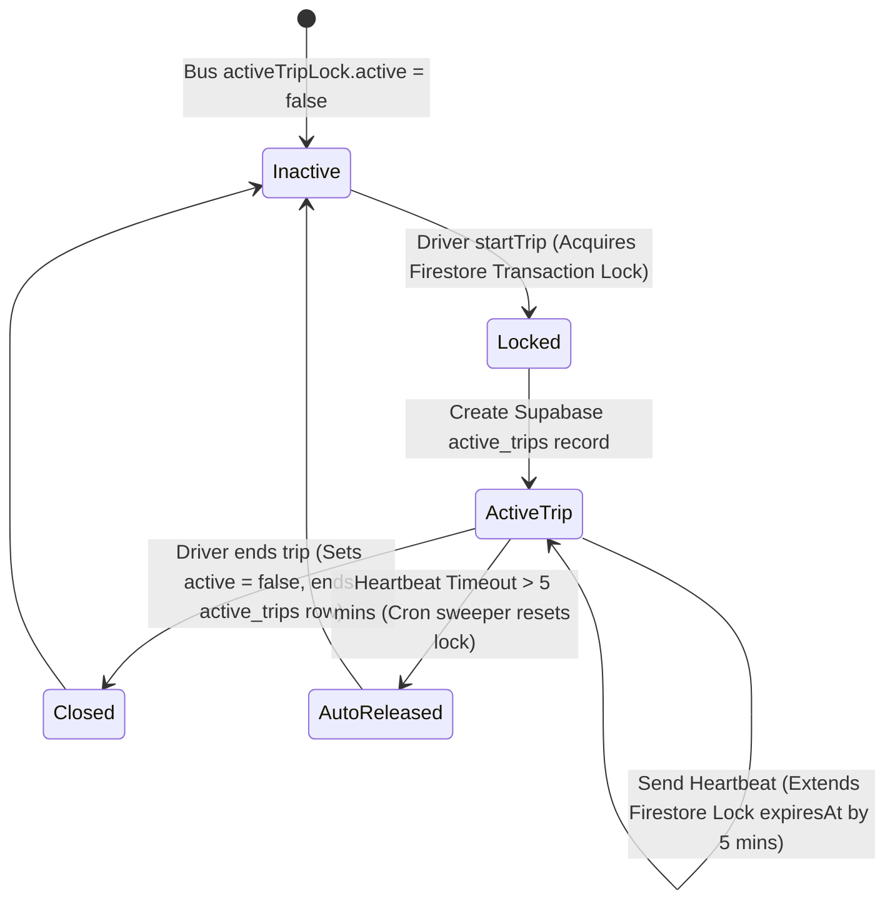

# 🚌 AdtU ITMS — Full System Architecture, Database Schema, and Flow Review
### Internal Technical Manual & Production-Readiness Review

This document contains a comprehensive architectural breakdown and code-level flow review of the **AdtU Integrated Transit Management System (ITMS)** for Assam down town University. 

---

## 1. Executive Technical Summary
The AdtU ITMS is an enterprise-grade transit orchestration system built for students, drivers, moderators, and admins. It integrates multi-user dashboards, live vector-based map telemetry, cryptographic ticketing, dynamic shift operations, and real-time system settings. 

The system utilizes a **Hybrid Multi-Cloud Architecture** combining:
*   **Vercel Serverless Edge/Node Runtime** as the application execution layer.
*   **Firebase Firestore & Auth** as the document master store for static configurations and user roles.
*   **Supabase PostgreSQL** as the high-velocity operational stream ledger and immutable transactional database.

Security is enforced through a centralized server-authoritative role checking system, digital QR verification signed via RSA-2048, and rate-limiting matrices.

---

## 2. Comprehensive Technology Stack & Dependencies
The following dependencies define the core application framework and infrastructure layers:

| Stack Layer | Technologies / Packages | Purpose |
| :--- | :--- | :--- |
| **Core Framework** | `next@16.1.1`, `react@19.2.3`, `typescript@5` | App Router server-side execution, Turbopack, and asynchronous component rendering. |
| **Identity & Database** | `firebase-admin@^12.0.0`, `@supabase/supabase-js@^2.39.0`, `pg` | Authentication custom claims; Firestore dynamic locks; Supabase PostgreSQL connection drivers. |
| **Security & Validation** | `zod@^3.22.0`, `crypto-js`, `rate-limiter-flexible` | Input validation schemas, AES-256-GCM symmetric block ciphers, and sliding-window rate limiters. |
| **Vector Mapping** | `maplibre-gl@^5.22.0`, `pmtiles@^4.4.1`, `leaflet` | Cost-free mapping via offline-capable PMTiles vector tile format styled at runtime. |
| **Communication** | `resend@^3.0.0`, `firebase-admin` (Messaging) | Transactional HTML email generation and FCM background push notifications. |
| **UI Orchestration** | `radix-ui`, `framer-motion`, `lucide-react`, `tailwindcss` | Accessible primitive components, spring animations, and responsive responsive layouts. |

---

## 3. System Architecture & Dual-Database Paradigm
ITMS deploys a **Bifurcated Storage Pattern** to leverage NoSQL scaling alongside SQL relational integrity:



### Firestore (NoSQL Node): Ephemeral & Broadcast State
Firestore is designated for low-latency writes and configuration singletons:
*   **Dynamic Configurations:** System parameters in `/config/config` and `/config/deadline-config`.
*   **Mutex Trip Locks:** Distributed mutex locks placed directly at `buses/{busId}` metadata.
*   **FCM Token Store:** Device pushes stored at `users/{uid}`.

### Supabase PostgreSQL (SQL Node): Relational & Audit Ledger
Supabase is designated for normalized relation structures:
*   **Core Schemas:** Structured relational records for swaps, payments, reassignments, and sessions.
*   **Relational integrity constraints:** Rigid schemas (e.g. `driver_swap_requests` referencing `drivers`) enforcing referential logic.
*   **Logical replication:** WAL logical replication broadcasts GPS movements via websockets natively to map frames.

---

## 4. Firebase Auth & Role Discovery Workflow
Authenticating client requests follows a strict role resolution pipeline. The server does not trust roles provided by client headers.



The role discovery code uses a caching mechanism to protect Firestore read quotas:
1.  **Token Extraction:** Intercepts `Authorization: Bearer <token>` or falls back to body-injected tokens if allowed.
2.  **Verify JWT:** Calls `adminAuth.verifyIdToken()` via Firebase Admin SDK.
3.  **Role Cache Check:** Checks Map-based `_roleCache` (expires in 5 minutes).
4.  **Waterfall Lookup:** Searches the `users` collection first. If missing, queries `admins`, `moderators`, `drivers`, and `students` collections concurrently via `Promise.all()` to resolve the role.

---

## 5. Security Proxy Framework & Runtime Loophole (middleware.ts bypass)
The repository contains an edge security proxy located at [src/proxy.ts](file:///c:/Users/ADMIN/Desktop/Projects/ITMS/src/proxy.ts). It defines features to protect the application:
*   **IP-Based Global Rate Limiting:** Limits requests to 300 per minute per IP.
*   **Suspicious Path Blocking:** Uses regular expressions to reject common scanning targets like `.php`, `wp-admin`, `.env`, and `.git` with a silent `404` to prevent footprinting.
*   **CSRF Protection:** Compares Request Origin and Referer headers against an whitelist of allowed domains.
*   **Security Header Injection:** Sets headers like `X-Frame-Options: DENY` and `X-Content-Type-Options: nosniff`.

### 🚨 Critical Loophole: Bypassed Execution
In Next.js, middleware must be defined as `middleware.ts` in the project root or the `src/` directory. Since this file is named `src/proxy.ts` and there is no `middleware.ts` file configured in the workspace, **this proxy is never loaded or executed by Next.js**. As a result, all edge rate limiting, CSRF verification, and scanner blocking protections are completely bypassed.

---

## 6. Dynamic Configuration Injection Engine
Configuration variables are injected dynamically. Code classes (like `/src/lib/system-config-service.ts`) fetch variables in real-time.

*   **Zero-Fallback Enforcement:** If the Firestore configuration document `settings/config` is missing, the backend throws a fatal error rather than fallback to defaults. This prevents the application from operating with stale parameters.
*   **UI Field Stripping:** When updating configs, `cleanConfigForStorage()` removes UI-related fields such as `icon`, `gradient`, `color`, and `description` before saving to prevent document size growth.
*   **History Bounding:** The `busFee.history` array is limited to the last 2 entries, allowing simple rollback capacity while preventing infinite document size inflation.

---

## 7. Firestore Security Rules and Access Control Matrix
The system applies rules defined in [firestore.rules](file:///c:/Users/ADMIN/Desktop/Projects/ITMS/firestore.rules). These rules enforce role-based access control at the database level:

```javascript
rules_version = '2';
service cloud.firestore {
  match /databases/{database}/documents {
    function isModerator(uid) { return exists(/databases/$(database)/documents/moderators/$(uid)); }
    function isDriver(uid) { return exists(/databases/$(database)/documents/drivers/$(uid)); }
    function isStudent(uid) { return exists(/databases/$(database)/documents/students/$(uid)); }
    function isAdmin(uid) { return exists(/databases/$(database)/documents/admins/$(uid)); }

    match /unauthUsers/{userId} {
      allow read: if request.auth != null && (request.auth.uid == userId || isAdmin(request.auth.uid));
      allow write: if request.auth != null && (request.auth.uid == userId || isAdmin(request.auth.uid));
    }
    match /students/{studentId} {
      allow read: if request.auth != null && (request.auth.uid == studentId || isAdmin(request.auth.uid) || isModerator(request.auth.uid));
      allow write: if request.auth != null && isAdmin(request.auth.uid);
    }
    match /scans/{scanId} {
      allow read: if request.auth != null;
      allow write: if false; // Denied to clients; server-only writes
    }
  }
}
```

This ensures that clients cannot directly write scan logs or modify critical registration entries without passing through backend validation APIs.

---

## 8. Supabase Relational Schema & Integrity Safeguards
The SQL schema in [supabase/COMPLETE_SCHEMA.sql](file:///c:/Users/ADMIN/Desktop/Projects/ITMS/supabase/COMPLETE_SCHEMA.sql) defines the relational database architecture:

```sql
-- Core schemas mapping relationship rules
CREATE TABLE public.active_trips (
  trip_id TEXT PRIMARY KEY,
  bus_id TEXT NOT NULL,
  driver_id TEXT NOT NULL,
  route_id TEXT NOT NULL,
  shift TEXT NOT NULL CHECK (shift IN ('morning', 'evening', 'both')),
  status TEXT NOT NULL DEFAULT 'active' CHECK (status IN ('active', 'ended')),
  start_time TIMESTAMPTZ NOT NULL DEFAULT NOW(),
  end_time TIMESTAMPTZ,
  last_heartbeat TIMESTAMPTZ NOT NULL DEFAULT NOW()
);

CREATE TABLE public.payments (
  payment_id TEXT PRIMARY KEY,
  student_uid TEXT NOT NULL,
  student_name TEXT NOT NULL, -- Stored encrypted (AES-256-GCM)
  student_id TEXT NOT NULL,   -- Stored encrypted (AES-256-GCM)
  amount NUMERIC NOT NULL,
  method TEXT NOT NULL CHECK (method IN ('Online', 'Offline')),
  offline_transaction_id TEXT, -- Stored encrypted (AES-256-GCM)
  document_signature TEXT,    -- RSA-2048 digital signature
  created_at TIMESTAMPTZ DEFAULT NOW()
);

-- Indexing for fast spatial and status updates
CREATE INDEX idx_bus_locations_bus_id_timestamp ON bus_locations(bus_id, timestamp DESC);
CREATE INDEX idx_active_trips_status_heartbeat ON active_trips(status, last_heartbeat);
```

Security is enforced using Postgres RLS policies, restricting students to read their own payment records while the API service-role has unrestricted access.

---

## 9. Cryptographic Services & Cryptosystem Setup
The system uses a cryptographic module at [src/lib/security/encryption.service.ts](file:///c:/Users/ADMIN/Desktop/Projects/ITMS/src/lib/security/encryption.service.ts) to encrypt sensitive data before it is saved to Supabase:

*   **Encryption Algorithm:** AES-256-GCM.
*   **Key Derivation:** PBKDF2 (10,000 iterations) using `ENCRYPTION_SECRET_KEY` and a salt derived from the document's primary key (e.g. `payment_id`), ensuring unique keys per database row.
*   **Plaintext Fallback Capability:** Decryption is wrapped in a fail-safe block. If decryption fails (due to invalid signatures or key change), the service returns the plaintext string. This prevents application crashes when loading legacy records.

---

## 10. RSA-2048 Digital Receipt Generation & QR Validation Flow
Tamper-proof ticketing uses RSA-2048 signing, implemented in [src/lib/security/document-crypto.service.ts](file:///c:/Users/ADMIN/Desktop/Projects/ITMS/src/lib/security/document-crypto.service.ts).



1.  **Signing Payload:** The canonical payload contains sorted payment fields (`receiptId`, `amount`, `studentUid`, `enrollmentId`, etc.).
2.  **SHA-256 Hash:** The fields are serialized as compact JSON and hashed via SHA-256.
3.  **RSA-2048 Sign:** The hash is signed via the RSA private key, generating a base64 signature.
4.  **Compact QR:** The QR code embeds a base64url payload with the prefix `ADTU-R2-`, containing only the Receipt ID and the first 64 characters of the signature.
5.  **Forensic Watermarking:** An invisible watermark (HMAC of UID, payment ID, and timestamp) is injected into PDF receipts to verify authenticity offline.

---

## 11. Secure Payment Concurrency & Razorpay Webhook Reconcile Flow
Payment flows are managed in [src/lib/payment/payment.service.ts](file:///c:/Users/ADMIN/Desktop/Projects/ITMS/src/lib/payment/payment.service.ts):

*   **Webhook Signature Check:** Razorpay webhook payloads are verified by hashing the raw body with `RAZORPAY_WEBHOOK_SECRET` using HMAC-SHA256:
    ```typescript
    const expected = crypto.createHmac('sha256', secret).update(rawBody).digest('hex');
    const isValid = crypto.timingSafeEqual(Buffer.from(signature), Buffer.from(expected));
    ```
*   **Idempotency Keys:** The system uses unique indexes on `payments.payment_id` and checks database status before processing. If a duplicate webhook event is received, it aborts immediately to prevent dual processing.

---

## 12. Driver Trip Lifecycle & Shift Lock Orchestration
Trip shift controls prevent multiple drivers from claiming the same bus, implemented in [src/lib/services/trip-lock-service.ts](file:///c:/Users/ADMIN/Desktop/Projects/ITMS/src/lib/services/trip-lock-service.ts).



*   **Firestore Mutex Lock:** An atomic transaction is executed on Firestore at `buses/{busId}`:
    - If `activeTripLock.active == true` and not expired, the request is rejected with `LOCKED_BY_OTHER`.
    - If unlocked, the transaction writes a lock with the driver's metadata, sets `active = true`, and sets `expiresAt` (now + 5 minutes).
*   **Supabase Log Insertion:** If the transaction succeeds, a row is inserted in Supabase's `active_trips` table. If the SQL insert fails, the Firestore lock is rolled back.
*   **Heartbeat Cache Throttling:** Heartbeats extend the lock's `expiresAt` timestamp in Firestore. To prevent constant Firestore write billing, writes are throttled to a minimum of 20 seconds using the in-memory map cache `heartbeatWriteCache`.

---

## 13. Live Location Telemetry & Adaptive Throttling Flow
GPS coordinate reporting uses adaptive throttling to balance accuracy and data write costs:

*   **Cadence Logic:** Telemetry cadences adjust based on GPS speed calculation:
    - **Stationary (< 2km/h):** Transmits location updates every 15 seconds.
    - **Transit (> 40km/h):** Transmits location updates every 3 seconds.
*   **Database Ingestion:** Updates are sent to Supabase `bus_locations`. By storing high-frequency GPS coordinates in Postgres WAL rather than Firestore, the system reduces database overhead and costs.

---

## 14. Vector Map Component Architecture & PMTiles Rendering
Vector mapping uses MapLibre and local PMTiles, implemented in [src/components/maps/GuwahatiMap.tsx](file:///c:/Users/ADMIN/Desktop/Projects/ITMS/src/components/maps/GuwahatiMap.tsx).

*   **Dynamic Map Selection:** `LiveTrackingBusMap.tsx` checks `config.mapProvider`. If "google", it imports Google Maps. If "guwahati", it loads MapLibre vector maps.
*   **Zero-Cost Offline Maps:** MapLibre loads vector tiles directly from a local archive: `/maps/guwahati.pmtiles`. It uses `pmtiles` as a protocol to extract vector chunks, completely bypassing external Mapbox or Google tile billing.
*   **Marker Animations:** Marker movement is animated using interpolation. Instead of jumping on coordinate updates, the bus marker slides over a 1000ms easing curve.

---

## 15. Student Dashboard & Registration Onboarding Flow
The student registration process handles onboarding and dynamic payments:

*   **Self-Registration:** New students submit details which are written to `unauthUsers/{uid}` in Firestore.
*   **Onboarding Fees:** Approved student profiles load dynamic fee settings from the system config.
*   **Redirect to Checkout:** Displays a payment wizard which locks with a loading spinner while Razorpay checkout is finalized.
*   **Boarding Card:** Shows a pass displaying active bus details and generating the secure `ADTU-R2-` QR code.

---

## 16. Driver Mobile Web App Dashboard Interface
The driver dashboard is optimized for mobile browser environments:

*   **High-Contrast UI:** Large components designed for quick tapping.
*   **Heartbeat Feedback:** A flashing visual indicator showing the status of the connection and GPS uploads.
*   **Scanner Overlay:** A scanning camera overlay that uses the browser's `BarcodeDetector` or fallbacks to the `jsQR` engine to parse student QR passes.

---

## 17. Moderator Dashboard & Granular Permissions System
Moderator accounts are restricted by granular, server-enforced permissions configured in [src/lib/types/moderator-permissions.ts](file:///c:/Users/ADMIN/Desktop/Projects/ITMS/src/lib/types/moderator-permissions.ts):

*   **Access Categories:** Permissions are divided into `students`, `drivers`, `buses`, `routes`, `applications`, and `payments`.
*   **Enforcement Pattern:** API routes check permissions using `requireModeratorPermission()`:
    - Admin users skip the check.
    - Moderator details are loaded from Firestore (`moderators/{uid}`).
    - Specific action permissions (e.g. `students.canReassign`) are verified, returning a `403 Forbidden` if denied.
*   **Cache:** Moderator permission structures are cached in memory for 60 seconds.

---

## 18. Admin Control Dashboard & System Controls
The administrative dashboard manages configurations and system health:

*   **Dynamic Settings Manager:** Updates fee values and deadline parameters in Firestore.
*   **System Controls:** Toggles settings such as `mapProvider` and feature flags (e.g., fallback options if external APIs fail).
*   **Audit Logger:** Inspects reassignments and exports payment records.

---

## 19. Reassignment Services & Student Transfer Flows
When buses are full or schedules change, admins run student reassignments via [src/lib/services/reassignment-service.ts](file:///c:/Users/ADMIN/Desktop/Projects/ITMS/src/lib/services/reassignment-service.ts):

*   **Transaction Batching:** To avoid Firestore timeouts on large transfers, reassignments are processed in batches of 80.
*   **Capacity Checks:** Runs checks within a Firestore transaction. Before updating student records, it loads current bus loads and verifies that the transfer won't exceed target bus capacity (for morning or evening shifts).
*   **Deltas Update:** Updates shift counts (`load.morningCount` and `load.eveningCount`) on the source and destination buses.
*   **Targeted Alerts:** Sends notifications to all reassigned students and the destination bus driver.

---

## 20. Firebase Cloud Messaging (FCM) & Push Notification Channels
Notification broadcasts are managed in [src/lib/services/fcm-notification-service.ts](file:///c:/Users/ADMIN/Desktop/Projects/ITMS/src/lib/services/fcm-notification-service.ts):

*   **Topic-Based Broadcasting:** When a driver starts or ends a trip, the backend sends a notification to the FCM topic `route_${routeId}`. This alerts all subscribed student devices in a single call without having to load or loop over individual device tokens.
*   **Idempotency Checks:** Uses Firestore flags (`startFcmSent`, `endFcmSent`) within the bus lock status. If an API call is retried, it checks the flags to prevent duplicate push notifications.

---

## 21. Transactional Email Pipeline & Resend Configuration
Transactional emails use Resend, implemented in [src/lib/services/admin-email.service.ts](file:///c:/Users/ADMIN/Desktop/Projects/ITMS/src/lib/services/admin-email.service.ts):

*   **Configuration:** Reads `RESEND_API_KEY` and `EMAIL_FROM` from the environment.
*   **Fallback:** If the API key is missing, the service falls back to writing email templates directly to the server logs. This prevents code execution blocks during local development.
*   **Templates:** Generates dark-themed HTML email templates for registrations, approvals, and rejections.

---

## 22. Service Worker Lifecycle, Caching & Offline Capabilities
PWA assets and offline behavior are managed by:
*   **Service Worker:** [public/firebase-messaging-sw.js](file:///c:/Users/ADMIN/Desktop/Projects/ITMS/public/firebase-messaging-sw.js) registers and handles background push notifications when the browser is closed.
*   **PWA Manifest:** [src/app/manifest.ts](file:///c:/Users/ADMIN/Desktop/Projects/ITMS/src/app/manifest.ts) configures icons, theme colors, and display attributes to support installation on mobile home screens.

---

## 23. Client-Side Cached Query Engine (usePaginatedCollection)
To prevent unnecessary reads, the admin panel uses a custom cache in [src/hooks/usePaginatedCollection.ts](file:///c:/Users/ADMIN/Desktop/Projects/ITMS/src/hooks/usePaginatedCollection.ts):

*   **Caching:** Standard Firestore queries are cached in memory for up to 24 hours.
*   **Event-Driven Invalidation:** When a database write (create, update, delete) occurs, the page dispatches an invalidation signal (`sessionStorage`). This clears the specific cache partition, forcing a reload on the next screen render.

---

## 24. Boarding Verification Is Verification-Only
The boarding verification flow no longer depends on Firestore `scans` audit records:

1.  **Rule Restriction:** Firestore security rules block client-side writes to the `scans` collection (`allow write: if false;`).
2.  **Verification APIs:** The verify APIs (`/api/bus-pass/verify-student` and `/api/bus-pass/verify-secure-qr`) perform checks and return verification status without writing `scans` records.
3.  **Removed Legacy Endpoint:** The obsolete `/api/bus-pass/boarding-action` route has been removed because it depended on missing `scans/{scanId}` documents.
    Because the verify endpoints never write the scan record, **this lookup always fails with a `404 Scan not found` error**. Additionally, the driver app frontend does not call this endpoint, rendering the boarding audit trail completely non-functional.

---

## 25. Distributed Keep-Alive Loop & Cron Lock Release
A cleanup cron releases driver locks when devices disconnect:

*   **Vercel Cron Trigger:** Pings `/api/cron/cleanup-stale-locks` every 60 seconds.
*   **Status Audit:** Queries Supabase `active_trips` for active shifts with `last_heartbeat` older than 5 minutes.
*   **Force Unlock:** Marks stale trips as ended in Supabase and sets `activeTripLock.active = false` in Firestore, releasing the bus lock so other drivers can operate it.

---

## 26. Haversine Proximity Controls & GPS Anti-Spoofing Filters
*   **Missed Bus Location Verification:** The missed bus request API `/api/missed-bus/create` performs a Haversine distance check between the student's pickup point and the bus coordinates. If the distance is less than 100 meters, the API rejects the request to prevent students from spamming the feature.
*   **GPS Speed Filter:** The location upload API `/api/driver/update-location` checks GPS speed:
    ```typescript
    const calculatedSpeed = distanceDelta / timeDelta;
    if (calculatedSpeed > 120) {
        console.warn('Rejected location update: calculated speed exceeds limits');
        return NextResponse.json({ success: false, error: 'Suspicious GPS data rejected' }, { status: 400 });
    }
    ```
    This blocks mock-location tools and spoofing attempts.
*   🚨 **Code Bug:** In the location update API (`/api/driver/update-location/route.ts`), the code calculates distance using `Math.random() * 5` rather than calling the defined `calculateDistance()` Haversine function. This bug renders the anti-spoofing distance checks ineffective.

---

## 27. File Registry: Critical Backend Services & API Handlers
The following backend files define the core business logic of the transit system:

| Backend Service / Handler File | Purpose |
| :--- | :--- |
| [`src/lib/security/api-security.ts`](file:///c:/Users/ADMIN/Desktop/Projects/ITMS/src/lib/security/api-security.ts) | Unified security wrapper (`withSecurity`) handling JWT, CSRF, rate-limiting, and validation. |
| [`src/lib/services/trip-lock-service.ts`](file:///c:/Users/ADMIN/Desktop/Projects/ITMS/src/lib/services/trip-lock-service.ts) | Trip lifecycle and exclusive bus lock manager. |
| [`src/lib/security/document-crypto.service.ts`](file:///c:/Users/ADMIN/Desktop/Projects/ITMS/src/lib/security/document-crypto.service.ts) | RSA-2048 keypair handling, hash generation, and receipt signature verification. |
| [`src/lib/services/reassignment-service.ts`](file:///c:/Users/ADMIN/Desktop/Projects/ITMS/src/lib/services/reassignment-service.ts) | Reassignment service for shifting students and updating loads. |
| [`src/lib/security/encryption.service.ts`](file:///c:/Users/ADMIN/Desktop/Projects/ITMS/src/lib/security/encryption.service.ts) | AES-256-GCM symmetric encryption for fields stored in Supabase. |
| [`src/app/api/driver/start-trip/route.ts`](file:///c:/Users/ADMIN/Desktop/Projects/ITMS/src/app/api/driver/start-trip/route.ts) | Initializes driver trip locks and Supabase trip logs. |
| [`src/app/api/driver/update-location/route.ts`](file:///c:/Users/ADMIN/Desktop/Projects/ITMS/src/app/api/driver/update-location/route.ts) | Receives GPS updates, checks speeds, and writes to database. |
| [`src/app/api/bus-pass/verify-student/route.ts`](file:///c:/Users/ADMIN/Desktop/Projects/ITMS/src/app/api/bus-pass/verify-student/route.ts) | Verifies student bus passes. |
| [`src/lib/services/admin-email.service.ts`](file:///c:/Users/ADMIN/Desktop/Projects/ITMS/src/lib/services/admin-email.service.ts) | Resend email service interface. |

---

## 28. File Registry: Key Frontend UI Components & State Hooks
The following frontend files drive the user dashboard interfaces:

| Frontend UI / Hook File | Purpose |
| :--- | :--- |
| [`src/app/driver/scan-pass/page.tsx`](file:///c:/Users/ADMIN/Desktop/Projects/ITMS/src/app/driver/scan-pass/page.tsx) | Driver QR scanner interface using native or library-based code. |
| [`src/components/maps/GuwahatiMap.tsx`](file:///c:/Users/ADMIN/Desktop/Projects/ITMS/src/components/maps/GuwahatiMap.tsx) | Renders MapLibre vector maps using the local PMTiles protocol. |
| [`src/hooks/usePaginatedCollection.ts`](file:///c:/Users/ADMIN/Desktop/Projects/ITMS/src/hooks/usePaginatedCollection.ts) | Implements client-side caching to reduce Firestore read counts. |
| [`src/hooks/useBusLocation.ts`](file:///c:/Users/ADMIN/Desktop/Projects/ITMS/src/hooks/useBusLocation.ts) | Subscribes student dashboards to live GPS telemetry. |
| [`src/hooks/useTripLock.ts`](file:///c:/Users/ADMIN/Desktop/Projects/ITMS/src/hooks/useTripLock.ts) | Enforces lockouts and monitors connection statuses for driver sessions. |
| [`src/components/BusPassScannerModal.tsx`](file:///c:/Users/ADMIN/Desktop/Projects/ITMS/src/components/BusPassScannerModal.tsx) | Driver QR scanner interface modal. |

---

## 29. Identified Production Risks & Configuration Deficiencies
The code review identified several security and reliability risks:

> [!WARNING]
> **1. Dead Security Proxy (`src/proxy.ts`)**
> The proxy logic is bypassed because Next.js only loads middleware named `middleware.ts`. All global rate limits, CSRF origin verification, and automated path blocking are currently disabled.
> *Mitigation:* Rename `src/proxy.ts` to `src/middleware.ts` (or import it from a root-level middleware file).

> [!CAUTION]
> **2. Broken Boarding Verification & Audit Trail**
> Verification APIs verify passes but do not write logs to the `scans` collection. The boarding action API attempts to retrieve these logs and fails, preventing boarding histories from being saved.
> *Mitigation:* Update the verification endpoints to write scan results to Firestore before returning the response.

> [!IMPORTANT]
> **3. Math.random() in Security Identifiers**
> Trip IDs are generated using `Math.random()`, which is predictable and insecure for system keys.
> *Mitigation:* Replace with `crypto.randomUUID()`.

> [!WARNING]
> **4. Mock Distance Delta Calculation**
> The location update API uses `Math.random() * 5` to calculate distance offsets, ignoring the defined Haversine checks. This breaks location spoofing detection.
> *Mitigation:* Update `update-location/route.ts` to call the `calculateDistance()` validation function.

---

## 30. Final Senior Architect Verdict & Production Readiness Audit
*   **What the system does well:** The dynamic settings framework, local Guwahati PMTiles vector rendering, and role resolution cache are well designed. The use of PBKDF2 GCM encryption for database fields is a solid security practice.
*   **What is production-grade:** The transaction-based `reassignment-service` (with batching and capacity checks) and the RSA-2048 signing code are robust.
*   **What is over-engineered:** The duplicate receipt cryptographic libraries are over-engineered. Having two separate key approaches (`receipt-security` with HMAC and `document-crypto` with RSA-2048 signatures) adds unnecessary complexity. The system should standardize on the RSA-2048 signature pattern.
*   **Ready for University Demo:** **Yes**. The core flows (UI dashboards, live tracking, and payments) function, making the application suitable for demonstrating system features.
*   **Ready for Live Production Use:** **No**. The system is not production-ready due to the bypassed edge proxy, broken scan logging, and predictable random trip IDs. Addressing these issues (renaming `proxy.ts` to `middleware.ts`, updating scan records on verification, and using secure UUIDs) is required before production deployment.
