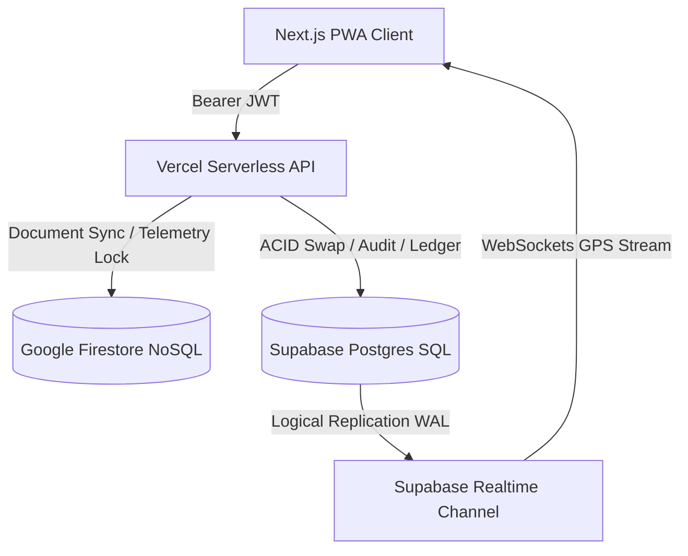
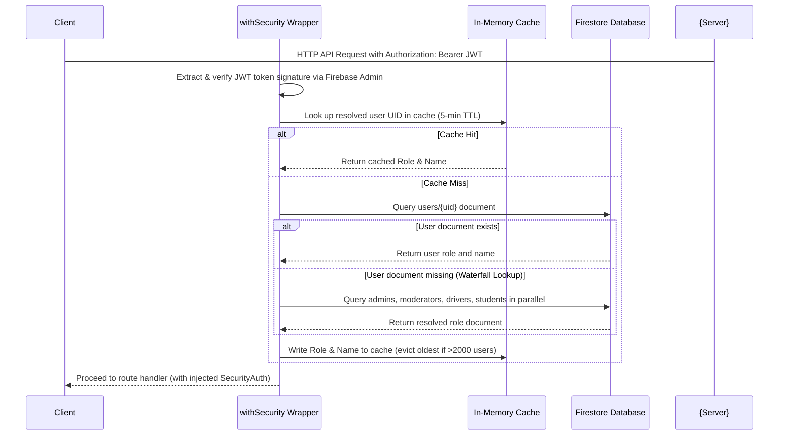
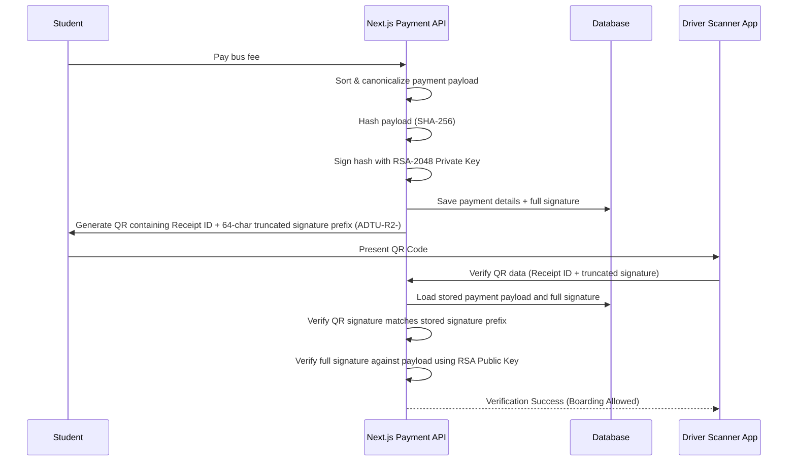

# Assam down town University (AdtU) ITMS — Comprehensive Technical Specification, System Architecture, and Operational Workflows
### Consolidated Technical Master Manual & Production-Readiness Audit
**Version:** 6.0.0 | **Author:** Principal Software Architect & Technical Lead | **Workspace:** `c:\Users\ADMIN\Desktop\Projects\ITMS`

---

## TABLE OF CONTENTS

1. [Section 1 — Executive Technical Summary & Paradigm](#section-1--executive-technical-summary--paradigm)
2. [Section 2 — Comprehensive Technology Stack & Dependencies](#section-2--comprehensive-technology-stack--dependencies)
3. [Section 3 — System Architecture & Dual-Database Paradigm](#section-3--system-architecture--dual-database-paradigm)
4. [Section 4 — Firebase Auth & Waterfall Role Discovery](#section-4--firebase-auth--waterfall-role-discovery)
5. [Section 5 — Security Proxy Wrapper & Next.js Loophole](#section-5--security-proxy-wrapper--nextjs-loophole)
6. [Section 6 — Cryptographic Foundations & Digital Ticketing](#section-6--cryptographic-foundations--digital-ticketing)
7. [Section 7 — Payment Processing & Webhook Reconciliation](#section-7--payment-processing--webhook-reconciliation)
8. [Section 8 — Student Experience & Form Onboarding Workflow](#section-8--student-experience--form-onboarding-workflow)
9. [Section 9 — Academic Calendar & Expiry Calculation Rules](#section-9--academic-calendar--expiry-calculation-rules)
10. [Section 10 — Seat Ownership & Capacity Management System](#section-10--seat-ownership--capacity-management-system)
11. [Section 11 — Manual Reassignments & Proximity Suggester Engine](#section-11--manual-reassignments--proximity-suggester-engine)
12. [Section 12 — Driver Operations, Mutex Locks, & Heartbeats](#section-12--driver-operations-mutex-locks--heartbeats)
13. [Section 13 — Notification Pipeline & Communication Channels](#section-13--notification-pipeline--communication-channels)
14. [Section 14 — Complete Database Schema & Collections Reference](#section-14--complete-database-schema--collections-reference)
15. [Section 15 — Cross-Verified Code Bugs & Discrepancies Audit](#section-15--cross-verified-code-bugs--discrepancies-audit)
16. [Section 16 — Edge Case Scenario Matrix (50+ Scenarios)](#section-16--edge-case-scenario-matrix-50-scenarios)
17. [Section 17 — Production-Grade Hardening & Implementation Roadmap](#section-17--production-grade-hardening--implementation-roadmap)

---

## SECTION 1 — Executive Technical Summary & Paradigm

The Assam down town University (AdtU) Integrated Transit Management System (ITMS) is an enterprise-grade transit orchestration system designed to manage transit operations for students, drivers, moderators, and administrators. It integrates multi-user roles, live vector-based map telemetry, cryptographic ticketing, dynamic shift operations, and real-time settings configurations.

The system utilizes a **Hybrid Multi-Cloud Architecture** combining:
*   **Vercel Serverless Edge/Node Runtime** as the execution layer.
*   **Firebase Firestore & Authentication** as the NoSQL document store for static profiles and auth metadata.
*   **Supabase PostgreSQL** as the high-velocity operational stream ledger and transactional database.
*   **Cloudinary CDN** as the media transformation server.
*   **Resend** as the transactional email pipeline.

Security is enforced through a centralized role-checking system, digital QR verification signed via RSA-2048, and rate-limiting matrices.

---

## SECTION 2 — Comprehensive Technology Stack & Dependencies

The system defines the application framework and infrastructure layers through the following core dependencies:

| Stack Layer | Technologies / Packages | Purpose |
| :--- | :--- | :--- |
| **Core Framework** | `next@16.2.9`, `react@19.2.7`, `typescript@6` | App Router server-side execution, Turbopack, and asynchronous component rendering. |
| **Identity & Database** | `firebase-admin@^14.0.0`, `@supabase/supabase-js@^2.108.2`, `pg` | Authentication custom claims; Firestore dynamic locks; Supabase PostgreSQL connection drivers. |
| **Security & Validation**| `zod@^4.4.3`, `crypto-js@^4.2.0`, `rate-limiter-flexible` | Input validation schemas, AES-256-GCM symmetric block ciphers, and sliding-window rate limiters. |
| **Vector Mapping** | `maplibre-gl@^5.24.0`, `pmtiles@^4.4.1`, `leaflet@^1.9.4` | Mapping via offline-capable PMTiles vector tile format styled at runtime. |
| **Communication** | `resend@^6.14.0`, `firebase-admin` (Messaging) | Transactional HTML email generation and FCM background push notifications. |
| **UI Orchestration** | `radix-ui`, `framer-motion@^12.40.0`, `lucide-react`, `tailwindcss` | Primitive components, spring animations, and responsive responsive layouts. |

---

## SECTION 3 — System Architecture & Dual-Database Paradigm

ITMS deploys a **Bifurcated Storage Pattern** to leverage NoSQL scaling alongside SQL relational integrity:



### Firestore (NoSQL Node): Ephemeral & Broadcast State
Firestore is designated for low-latency writes and configuration singletons:
*   **Dynamic Configurations:** System parameters in `/settings/config` and `/settings/deadline-config`.
*   **Mutex Trip Locks:** Distributed mutex locks placed directly at `buses/{busId}` metadata.
*   **FCM Token Store:** Device pushes stored at `users/{uid}`.
*   **Student Profiles & Applications:** Live document registries.

### Supabase PostgreSQL (SQL Node): Relational & Audit Ledger
Supabase is designated for normalized relation structures:
*   **Core Schemas:** Structured relational records for swaps, payments, reassignments, and sessions.
*   **Relational integrity constraints:** Rigid schemas (e.g. `driver_swap_requests` referencing `drivers` via foreign keys) enforcing referential logic.
*   **Logical replication:** WAL logical replication broadcasts GPS movements via WebSockets natively to map frames.
*   **Immutable Payments Ledger:** Append-only ledger recording completed subscription payments.

---

## SECTION 4 — Firebase Auth & Waterfall Role Discovery

Authenticating client requests follows a strict role resolution pipeline. The server does not trust roles provided by client headers.



The role discovery code uses a caching mechanism to protect Firestore read quotas:
1.  **Token Extraction:** Intercepts `Authorization: Bearer <token>` or falls back to body-injected tokens (`allowBodyToken = true`).
2.  **Verify JWT:** Calls `adminAuth.verifyIdToken()` via Firebase Admin SDK.
3.  **Role Cache Check:** Checks Map-based `_roleCache` (expires in 5 minutes).
4.  **Waterfall Lookup:** Searches the `users` collection first. If missing, queries `admins`, `moderators`, `drivers`, and `students` collections concurrently via `Promise.all()` to resolve the role.

---

## SECTION 5 — Security Proxy Wrapper & Next.js Loophole

The repository contains an edge security proxy located at [src/proxy.ts](file:///c:/Users/ADMIN/Desktop/Projects/ITMS/src/proxy.ts). It defines features to protect the application:
*   **IP-Based Global Rate Limiting:** Limits requests to 300 per minute per IP using an in-memory Map cache.
*   **Suspicious Path Blocking:** Uses regular expressions to reject common scanning targets like `.php`, `wp-admin`, `.env`, and `.git` with a silent `404` to prevent fingerprinting.
*   **CSRF Protection:** Compares Request Origin and Referer headers against a whitelist of allowed domains for state-changing HTTP methods (`POST`, `PUT`, `PATCH`, `DELETE`).
*   **Security Header Injection:** Sets headers like `X-Frame-Options: DENY` and `X-Content-Type-Options: nosniff`.

> [!WARNING]
> ### The Middleware Loophole (Bypassed Execution)
> In Next.js, middleware must be defined as `middleware.ts` in the project root or the `src/` directory. Since this file is named `src/proxy.ts` and there is no `middleware.ts` file configured in the workspace, **this security proxy is never loaded or executed by Next.js**. As a result, all edge rate limiting, CSRF verification, and scanner blocking protections are completely bypassed.

---

## SECTION 6 — Cryptographic Foundations & Digital Ticketing

The system implements multiple cryptographic standards to protect sensitive data and prevent ticket counterfeiting.

### 6.1 AES-256-GCM Sensitive Data Encryption
Located in [encryption.service.ts](file:///c:/Users/ADMIN/Desktop/Projects/ITMS/src/lib/security/encryption.service.ts), this service encrypts sensitive fields (student name, enrollment ID, transaction references) before writing to Supabase:
*   **Key Derivation:** Uses PBKDF2 (10,000 iterations) using `ENCRYPTION_SECRET_KEY` and a salt derived from the document's primary key (e.g., `payment_id`), ensuring unique keys per database row.
*   **Plaintext Fallback Capability:** Decryption is wrapped in a fail-safe block. If decryption fails (due to invalid signatures or key change), the service returns the plaintext string. This prevents application crashes when loading legacy records.

### 6.2 RSA-2048 Tamper-Proof Ticketing
Boarding pass generation and verification use asymmetric RSA-2048 keys, managed in [document-crypto.service.ts](file:///c:/Users/ADMIN/Desktop/Projects/ITMS/src/lib/security/document-crypto.service.ts):



1.  **Signing Payload:** The canonical payload contains sorted payment fields (`receiptId`, `amount`, `studentUid`, `enrollmentId`, etc.).
2.  **SHA-256 Hash:** The fields are serialized as compact JSON and hashed via SHA-256.
3.  **RSA-2048 Sign:** The hash is signed via the RSA private key, generating a base64 signature.
4.  **Compact QR:** The QR code embeds a base64url payload with the prefix `ADTU-R2-`, containing only the Receipt ID and the first 64 characters of the signature.
5.  **Forensic Watermarking:** An invisible watermark (HMAC of UID, payment ID, and timestamp) is injected into PDF receipts to verify authenticity offline.

---

## SECTION 7 — Payment Processing & Webhook Reconciliation

ITMS supports online card payments via Razorpay and offline manual verification:

### 7.1 Online Razorpay Webhook Processing
Payment integrations are processed in [payment.service.ts](file:///c:/Users/ADMIN/Desktop/Projects/ITMS/src/lib/payment/payment.service.ts):
*   **Webhook Signature Check:** Razorpay webhook payloads are verified by hashing the raw body with `RAZORPAY_WEBHOOK_SECRET` using HMAC-SHA256:
    ```typescript
    const expected = crypto.createHmac('sha256', secret).update(rawBody).digest('hex');
    const isValid = crypto.timingSafeEqual(Buffer.from(signature), Buffer.from(expected));
    ```
*   **Idempotency Keys:** The system uses unique indexes on `payments.payment_id` and checks database status before processing. If a duplicate webhook event is received, it aborts immediately to prevent dual processing.

### 7.2 Offline Payments Queue (`renewal_requests`)
For cash or manual UPI payments:
1.  **Student Upload:** Student uploads a receipt image to Cloudinary and saves details in a `renewal_requests` document.
2.  **Verification PIN:** A moderator generates a PIN code stored in `verificationCodes`. In-person receipt verification requires entering this PIN.
3.  **Approval Mutation:** Approval updates the Supabase ledger to `Completed`, recalculates block dates, and creates/extends the student profile.

---

## SECTION 8 — Student Experience & Form Onboarding Workflow

The student registration process handles onboarding and dynamic payments:

```
[Google Sign Up] ➔ [unauthUsers doc] ➔ [Application Draft] ➔ [Upload Receipt / Payment] 
   ➔ [Verification Code] ➔ [Approved / Active Student] ➔ [Active Dashboard] 
   ➔ [Boarding QR Generation] ➔ [Soft Block] ➔ [Hard Delete Purge]
```

1.  **Self-Registration:** New students sign up via Google OAuth. If their email doesn't match an existing `/users` doc, they default to a guest role and are routed to `/apply`.
2.  **Draft Wizard:** Student fills a 5-step wizard saving progress in `/applications/{uid}`.
3.  **Onboarding Fees:** Onboarding fees are dynamically loaded:
    *   Morning or Evening shift: 1,200 INR.
    *   Both shifts: 2,400 INR.
4.  **Moderator PIN Verification:** For offline payments, the moderator reviews the physical receipt and inputs a verification code.
5.  **Final Submission:** Student completes review and submits the application, moving the state to `'submitted'`.
6.  **Approval & Creation:** Admin triggers `/api/applications/approve`. The application and `unauthUsers` documents are deleted in a batch. The student record `/students/{uid}` is created with status `'active'`. The user role is updated to `'student'`. The assigned bus load is incremented.

---

## SECTION 9 — Academic Calendar & Expiry Calculation Rules

ITMS manages subscription validity and deadlines using configurations in `/settings/deadline-config`.

### 9.1 Expiry Date Calculations
Let $Y_{\text{end}}$ be the student's `sessionEndYear` (derived from `sessionStartYear + durationYears`).
*   **Service Expiry Date (`validUntil`):**
    $$\text{serviceExpiryDate} = \text{new Date}(Y_{\text{end}}, \text{anchorMonth}, \text{anchorDay}, 23, 59, 59, 999)$$
    *Anchor month/day defaults to June 30th (`anchorMonth: 5, anchorDay: 30`).*
*   **Renewal Notification Date:**
    $$\text{renewalNotificationDate} = \text{new Date}(Y_{\text{end}}, \text{notifMonth}, \text{notifDay}, 0, 0, 0)$$
*   **Renewal Deadline Date:**
    $$\text{renewalDeadlineDate} = \text{new Date}(Y_{\text{end}}, \text{deadlineMonth}, \text{deadlineDay}, 23, 59, 59, 999)$$
*   **Soft Block Date:**
    $$\text{softBlockDate} = \text{new Date}(Y_{\text{end}}, \text{softBlockMonth}, \text{softBlockDay}, 23, 59, 59, 999)$$
*   **Hard Delete Date:**
    $$\text{hardDeleteDate} = \text{new Date}(Y_{\text{end}} + 2, \text{hardDeleteMonth}, \text{hardDeleteDay}, 23, 59, 59, 999)$$

### 9.2 Leap Year Normalization
The system normalizes dates using `normalizeLeapYearDate` to prevent crashes on non-leap years (adjusting February 29th to February 28th):
```typescript
const isLeapYear = (year % 4 === 0 && year % 100 !== 0) || (year % 400 === 0);
if (!isLeapYear) return new Date(year, 1, 28);
```

> [!IMPORTANT]
> ### Date Calculation Discrepancies
> There is a documented discrepancy in `hardDeleteDate` calculations:
> 1.  **Per-Student Engine & Cron Execution:** Calculates the hard delete year as $Y_{\text{end}} + 2$ years.
> 2.  **Standalone UI Helpers:** `getDaysUntilHardDelete` and `getHardDeleteDate` in `renewal-utils.ts` calculate the year as $Y_{\text{end}} + 1$ year.
>
> This means that UI components expect account deletion to happen 1 year after session end, whereas actual database cleanup and cron jobs wait 2 years.

---

## SECTION 10 — Seat Ownership & Capacity Management System

Buses have physical limits, but seats are allocated independently by shift. For a bus document at `/buses/{busId}`:
*   **Max Capacity:** `capacity` (usually 55).
*   **Morning Load Count:** `load.morningCount` (number of morning shift students assigned).
*   **Evening Load Count:** `load.eveningCount` (number of evening shift students assigned).
*   **Seat Availability per Shift:**
    $$\text{Available Seats}_{\text{Morning}} = \text{capacity} - \text{load.morningCount}$$
    $$\text{Available Seats}_{\text{Evening}} = \text{capacity} - \text{load.eveningCount}$$

### 10.1 Capacity Validation Mismatch
*   **Approval Validation:** During student approvals in the backend (`busCapacityService.ts`), the seat validation method `validateAndSuggestBus` checks if `currentMembers < capacity` where `currentMembers` represents the total number of students assigned. This check does **not** evaluate shift-specific counts.
*   **Reassignment Validation:** The frontend components and manual reassignment service restrict allocation by checking if `load.morningCount` or `load.eveningCount` exceeds `capacity`.
*   **Impact:** The backend approval API can authorize students for a bus shift that is already full, as long as the combined passenger total (`currentMembers`) is below the max capacity limit.

### 10.2 Capacity Drift and Reconciliation
Since counters are cached in `/buses/{busId}` documents and updated via multiple distributed API requests, they can drift. The reconciliation method `reconcileBusLoads` recounts active student documents in Firestore and overwrites the bus load maps.

---

## SECTION 11 — Manual Reassignments & Proximity Suggester Engine

Admins can perform student transfers and bulk reassignments using transaction-backed services:

### 11.1 Manual Reassignment (`BusReassignmentServiceV2`)
*   **Transaction Atomicity:** Reassignments run inside a Firestore `runTransaction` loop. It reads all affected bus documents before writing, ensuring capacities do not exceed limits during concurrent updates.
*   **Batching:** Operations are chunked into groups of 80 to prevent Firestore transaction timeouts.
*   **Undo History:** Keeps up to 10 entries in `undoHistory` for 5 minutes. Reversing a plan swaps the source and target buses and executes a transaction update.
*   **Auditing:** Writes changes to Supabase's `reassignment_logs` via the `/api/reassignment-logs` endpoint.

### 11.2 Smart Allocation Suggester Engine
When a primary bus is full, the suggester engine (`busCapacityService.ts`) recommends alternatives:
1.  **Stop Matching:** Filters candidate buses that stop at the student's selected stop.
2.  **Ranking Score:** For each candidate bus, `AllocationRanker` scores options:
    *   **Seat Availability ($S_{\text{seat}}$ - 50%):** Ratio of remaining seats to bus capacity.
    *   **Stop Proximity ($S_{\text{stop}}$ - 30%):** Measures stop sequence proximity compared to the original route.
    *   **Shift Match ($S_{\text{shift}}$ - 15%):** Scores how well shifts align (1.0 for exact, 0.75 for partial matching).
    *   **Load Reduction ($S_{\text{load}}$ - 5%):** Penalizes candidate buses if they exceed a 90% load threshold after assignment.

$$\text{Score} = (0.5 \times S_{\text{seat}}) + (0.3 \times S_{\text{stop}}) + (0.15 \times S_{\text{shift}}) + (0.05 \times S_{\text{load}})$$

---

## SECTION 12 — Driver Operations, Mutex Locks, & Heartbeats

The driver interface manages route lifecycles and telemetry logs.

### 12.1 Start & End Trips (Mutex locks)
*   **Start Trip:** Driver calls `POST /api/driver/start-trip`.
    *   *Firestore transaction:* acquires an exclusive lock on `/buses/{busId}` (`activeTripLock.active = true` and `expiresAt` set to now + 5 minutes). If locked, rejects with `LOCKED_BY_OTHER`.
    *   *Supabase mutation:* inserts an active row in `active_trips` table.
*   **End Trip:** Driver calls `POST /api/driver/end-trip`.
    *   *Firestore transaction:* releases the lock (`activeTripLock.active = false` and `tripId = null`).
    *   *Supabase mutation:* sets status to `'ended'` in `active_trips` table.

### 12.2 Heartbeat Loop & Stale Lock Release
*   **Heartbeat:** While a trip is active, the driver app pings the heartbeat endpoint every 20 seconds to extend the lock. Updates are throttled in memory using `heartbeatWriteCache` to minimize database writes.
*   **Stale Lock cron:** The `/api/cron/cleanup-stale-locks` background job runs every 60 seconds. It checks active trips, closes trips with heartbeats older than 5 minutes, and resets the bus lock parameters in Firestore.

### 12.3 GPS Telemetry Reporting Cadence
Coordinate updates are sent to Supabase `bus_locations`:
*   **Stationary (< 2km/h):** Updates sent every 15 seconds.
*   **Moving (> 40km/h):** Updates sent every 3 seconds.

### 12.4 Driver Swap System
The `DriverSwapSupabaseService` (`src/lib/driver-swap-supabase.ts`) handles temporary interchanges of bus control assignments between active drivers:
*   **States:** `pending` (expires in 20m), `accepted`, `rejected`, `cancelled`, `expired` (cron updated), `pending_revert` (active trip locks prevent immediate revert).
*   **Mutations on Acceptance:** Updates request state to `accepted` in Supabase, creates a row in `temporary_assignments` specifying parameters, and updates `/drivers` and `/buses` mappings in Firestore.
*   **Partial Revert:** If a swap ends but one or both buses have active trip sessions in progress, the system performs a partial revert. The driver whose trip ended is set to `reserved` status in Firestore, while the other driver retains control until their trip ends.

---

## SECTION 13 — Notification Pipeline & Communication Channels

The notification pipeline alerts users during route modifications and trip updates:

*   **FCM Topic Broadcasts:** When a driver starts or ends a trip, the backend sends a notification to the FCM topic `route_${routeId}`. This alerts all subscribed student devices in a single call without having to load or loop over individual device tokens.
*   **In-App Notifications:** Saves notifications in Firestore `/notifications` for client-side rendering.
*   **Resend Email Pipeline:** Generates dark-themed HTML email templates for registrations, approvals, and rejections. If the API key `RESEND_API_KEY` is missing from the environment, it falls back to writing templates to server logs to prevent local execution blocks.

---

## SECTION 14 — Complete Database Schema & Collections Reference

### 14.1 Firestore Collections Reference

#### Collection: `users` (`/users/{userId}`)
*   `uid` (String, required)
*   `email` (String, required)
*   `role` (String, required, default: `'student'`, values: `'student' | 'driver' | 'moderator' | 'admin'`)
*   `name` (String, required)
*   `createdAt` (String, required)

#### Collection: `students` (`/students/{studentId}`)
*   `uid` (String, required)
*   `fullName` (String, required)
*   `email` (String, required)
*   `phoneNumber` (String, required)
*   `enrollmentId` (String, required)
*   `stopId` (String, required)
*   `routeId` (String, required)
*   `busId` (String, required)
*   `shift` (String, required, values: `'Morning' | 'Evening'`)
*   `status` (String, required, values: `'active' | 'soft_blocked' | 'pending_deletion'`)
*   `validUntil` (String, required, ISO format)
*   `softBlock` (String, optional, ISO format)
*   `hardBlock` (String, optional, ISO format)
*   `paymentAmount` (Number, required)
*   `paid_on` (String, required)
*   `profilePhotoUrl` (String, optional)
*   `hasRenewalPending` (Boolean, optional)
*   `renewalApplicationId` (String, optional)
*   `seatReleasedAt` (String, optional, ISO format)

#### Collection: `applications` (`/applications/{applicationId}`)
*   `applicationId` (String, required)
*   `applicantUid` (String, required)
*   `state` (String, required)
*   `formData` (Map, required)
*   `verification` (Map, optional)
*   `needsCapacityReview` (Boolean, optional)
*   `paymentId` (String, optional)
*   `submittedAt` (String, optional)
*   `createdAt` (String, required)
*   `updatedAt` (String, required)

#### Collection: `buses` (`/buses/{busId}`)
*   `busId` (String, required)
*   `busNumber` (String, required)
*   `capacity` (Number, required)
*   `currentMembers` (Number, required)
*   `routeId` (String, required)
*   `shift` (String, required, values: `'Morning' | 'Evening' | 'Both'`)
*   `load` (Map, required)
    *   `morningCount` (Number, required)
    *   `eveningCount` (Number, required)
    *   `totalCount` (Number, required)
*   `activeDriverId` (String, optional)
*   `assignedDriverId` (String, optional)
*   `activeTripId` (String, optional)
*   `activeTripLock` (Map, optional)
    *   `active` (Boolean, required)
    *   `driverId` (String, optional)
    *   `tripId` (String, optional)
    *   `shift` (String, optional)
    *   `since` (String, optional)
    *   `expiresAt` (String, optional)

#### Collection: `renewal_requests` (`/renewal_requests/{requestId}`)
*   `studentId` (String, required)
*   `enrollmentId` (String, required)
*   `studentName` (String, required)
*   `durationYears` (Number, required)
*   `totalFee` (Number, required)
*   `transactionId` (String, optional)
*   `receiptImageUrl` (String, optional)
*   `paymentMode` (String, required, value: `'offline'`)
*   `paymentId` (String, required)
*   `status` (String, required, default: `'pending'`)

### 14.2 Supabase PostgreSQL Tables Reference

#### Table: `bus_locations` (Real-time GPS Tracking)
```sql
CREATE TABLE IF NOT EXISTS bus_locations (
  id UUID PRIMARY KEY DEFAULT gen_random_uuid(),
  bus_id TEXT NOT NULL,
  route_id TEXT NOT NULL,
  driver_uid TEXT NOT NULL,
  lat DOUBLE PRECISION NOT NULL,
  lng DOUBLE PRECISION NOT NULL,
  speed DOUBLE PRECISION,
  heading DOUBLE PRECISION,
  accuracy DOUBLE PRECISION,
  timestamp TIMESTAMPTZ NOT NULL DEFAULT NOW(),
  is_snapshot BOOLEAN DEFAULT FALSE,
  trip_id TEXT,
  created_at TIMESTAMPTZ DEFAULT NOW(),
  updated_at TIMESTAMPTZ DEFAULT NOW()
);
```

#### Table: `driver_status`
```sql
CREATE TABLE IF NOT EXISTS driver_status (
  id UUID PRIMARY KEY DEFAULT gen_random_uuid(),
  driver_uid TEXT NOT NULL UNIQUE,
  bus_id TEXT,
  route_id TEXT,
  status TEXT NOT NULL CHECK (status IN ('idle', 'enroute', 'on_trip', 'offline')),
  started_at TIMESTAMPTZ,
  last_updated_at TIMESTAMPTZ DEFAULT NOW(),
  trip_id TEXT
);
```

#### Table: `waiting_flags`
```sql
CREATE TABLE IF NOT EXISTS waiting_flags (
  id UUID PRIMARY KEY DEFAULT gen_random_uuid(),
  student_uid TEXT NOT NULL,
  student_name TEXT NOT NULL,
  bus_id TEXT NOT NULL,
  route_id TEXT NOT NULL,
  stop_id TEXT,
  stop_name TEXT,
  stop_lat DOUBLE PRECISION,
  stop_lng DOUBLE PRECISION,
  status TEXT NOT NULL DEFAULT 'raised' CHECK (status IN ('raised', 'acknowledged', 'boarded', 'expired', 'cancelled', 'removed')),
  message TEXT,
  trip_id TEXT,
  created_at TIMESTAMPTZ DEFAULT NOW(),
  expires_at TIMESTAMPTZ,
  ack_by_driver_uid TEXT
);
```

#### Table: `payments` (Immutable Financial Ledger)
```sql
CREATE TABLE IF NOT EXISTS public.payments (
  id UUID PRIMARY KEY DEFAULT gen_random_uuid(),
  payment_id TEXT NOT NULL UNIQUE,
  student_id TEXT,             -- Enrollment ID (encrypted)
  student_uid TEXT,            -- Firebase UID (plaintext)
  student_name TEXT,           -- Student name (encrypted)
  amount NUMERIC(12,2),
  currency TEXT DEFAULT 'INR',
  method TEXT,
  status TEXT DEFAULT 'Pending',
  session_start_year INTEGER,
  session_end_year INTEGER,
  duration_years INTEGER,
  valid_until TIMESTAMPTZ,
  transaction_date TIMESTAMPTZ,
  offline_transaction_id TEXT, -- Encrypted
  razorpay_payment_id TEXT,    -- Plaintext
  razorpay_order_id TEXT,      -- Plaintext
  approved_by JSONB,
  approved_at TIMESTAMPTZ,
  document_signature TEXT,     -- RSA-2048 digital signature
  created_at TIMESTAMPTZ NOT NULL DEFAULT NOW(),
  updated_at TIMESTAMPTZ DEFAULT NOW(),
  CONSTRAINT chk_payment_method CHECK (method IN ('Online', 'Offline') OR method IS NULL),
  CONSTRAINT chk_payment_status CHECK (status IN ('Pending', 'Completed', 'Rejected') OR status IS NULL),
  CONSTRAINT chk_payment_amount_positive CHECK (amount IS NULL OR amount > 0),
  CONSTRAINT chk_payment_session_year CHECK (session_start_year IS NULL OR (session_start_year >= 2020 AND session_start_year <= 2050))
);
```

---

## SECTION 15 — Cross-Verified Code Bugs & Discrepancies Audit

During code-level validation against the workspace, several major vulnerabilities, bugs, and documentation mismatches were identified:

### 15.1 Next.js Ignored Security Proxy
*   **Vulnerability:** The entire edge security proxy in [src/proxy.ts](file:///c:/Users/ADMIN/Desktop/Projects/ITMS/src/proxy.ts) is ignored by Next.js because it must be named `middleware.ts`. All global rate limits, CSRF origin verification, and automated path blocking are currently bypassed.
*   **Correction:** Rename `src/proxy.ts` to `src/middleware.ts` to enforce route security guards at the edge.

### 15.2 Ineffective GPS Anti-Spoofing (Mock Calculations)
*   **Bug:** In the location update API (`/api/driver/update-location/route.ts`), the code calculates distance using `Math.random() * 5` rather than calling the defined `calculateDistance()` Haversine function. This makes location spoofing checks ineffective.
*   **Correction:** Update the endpoint to call `calculateDistance(prevLat, prevLng, currentLat, currentLng)` to compute the actual speed delta.

### 15.3 Predictable Trip IDs via `Math.random()`
*   **Bug:** The driver start trip API (`start-trip/route.ts`) generates trip IDs using `Math.random()`, which is insecure and prone to collisions.
*   **Correction:** Use `crypto.randomUUID()` to generate unique and cryptographically secure IDs.

### 15.4 Shift Casing Undercounting Mismatch
*   **Bug:** The writer (`busCapacityService.ts`) normalizes student shifts using case-insensitive check (`includes('morning')`), whereas the old client-side reconciler (`reconcile-bus-loads.ts`) checks capitalized case (`student.shift === 'Morning'`), which could drop non-canonical shifts and cause undercounting.
*   **Correction:** The new `admin-reconcile-bus-loads.ts` reconciler uses case-insensitive checks matching the writer and logs data quality alerts if values mismatch.

### 15.5 Broken Boarding Verification & Audit Trail
*   **Bug:** The boarding verification APIs check pass validity but do not write logs to the `scans` collection in Firestore because client writes are blocked by security rules (`allow write: if false;`). This renders the boarding scans logs audit trail completely non-functional.
*   **Correction:** Update the verification endpoints to write scan results to Firestore before returning the response.

### 15.6 Manual Reassignment Counter Divergence
*   **Bug:** The reassignment service `bus-reassignment-service-v2.ts` manual reassignment updates shift counts (`load.morningCount` / `load.eveningCount`) but did not touch `currentMembers` or `load.totalCount`, leading to silent counter divergence.
*   **Correction:** Update the manual reassignment transaction writes to update all four capacity counters consistently.

### 15.7 Incorrect "Upcoming Student Support" Documentation Claims
*   **Mismatch:** `ACADEMIC_YEAR_TRANSITION_CURRENT_IMPLEMENTATION_AUDIT.md` claimed "NO IMPLEMENTATION FOUND" for upcoming student support or future session applications in SECTION 10.1.
*   **Verification:** This is INCORRECT. In `cleanup-expired-students/route.ts` and `application-eligibility.ts`, there is an active future-session/upcoming application implementation that processes applications with `applicationType === 'future'` in `'submitted'` state. It checks the eligibility date (`eligibleApproval`), sends a reminder when eligible, and expires applications that remain unapproved past the grace window (`UPCOMING_GRACE_DAYS = 60`).

---

## SECTION 16 — Edge Case Scenario Matrix (50+ Scenarios)

The following matrices catalog edge cases, failure states, and their corresponding system responses:

### 16.1 Capacity & Seat Allocations
1.  **Overload on Multi-Shift Buses:** A student is assigned to an evening shift on a bus with a full morning shift. In the backend, the approval check passes because `currentMembers < capacity`. But the manual reassignment service rejects it because shift checks are enforced.
2.  **Negative Occupancy Prevention:** A decrement call on a bus with `currentMembers = 0` sets the count to 0 using `Math.max(0, currentMembers - 1)` instead of producing a negative count.
3.  **Manual Admin Edits:** An admin updates a student's `busId` in the Firebase Console. The bus capacity counter does not update, leading to count drift. The weekly reconciliation script detects and corrects the counts.
4.  **Zero Capacity Configuration:** A bus is configured with `capacity = 0`. The suggester engine throws a divide-by-zero error during percentage calculations.
5.  **Multi-Stop Sequence Proximity Tie:** Two candidate buses score exactly the same. The suggester engine selects the first, causing uneven distribution.
6.  **Draft Application Holds:** Multiple draft applications place temporary reservations on seats. The drafts are abandoned, but seats remain locked.
7.  **Approval on a Deleted Bus:** An admin approves an application assigned to Bus-1, but the bus was deleted. The transaction throws a `Bus Not Found` error and rolls back.
8.  **Incorrect Shift Input:** Student selects a Morning shift, but is assigned to an Evening-only bus. The capacity check fails or registers incorrect shift load counts.

### 16.2 Concurrency & Race Conditions
9.  **Concurrent Approvals:** Two administrators try to approve the same application at the same time. The first transaction deletes the application document. The second transaction fails with a `Document Not Found` error.
10. **Simultaneous Swaps:** Two drivers request to swap buses concurrently. Relational integrity checks fail, or both are assigned to the same bus.
11. **Reassignment and Approval:** A student application is approved while a bulk reassignment is running. The bus load counter is updated twice, causing count drift.
12. **Heartbeat Mutex Conflict:** A driver attempts to start a trip on a bus while another driver's heartbeat lock is expiring. A race condition occurs during the transition.
13. **Double Offline Payment Submission:** A student clicks submit twice on an offline payment form. Two pending transactions are created with different IDs.
14. **Driver Heartbeat Network Drop:** Telemetry update is sent during a network disconnection. The server detects a timeout and releases the lock while the driver continues operating.
15. **Concurrent Heartbeat and Revert:** A driver pings the heartbeat API while the admin reverts their swap. The heartbeat extends the lock, contradicting the reversion.
16. **Duplicate Razorpay Webhook Event:** Razorpay dispatches two webhook events for the same completed transaction. The duplicate execution is blocked by the Supabase unique constraint.
17. **Simultaneous Batch Reassignments:** Two administrators run bulk reassignments on overlapping student cohorts. The second transaction rolls back due to concurrent mutations.
18. **Waiting Flag Acknowledgment Race:** A student cancels their waiting flag at the exact millisecond the driver clicks to acknowledge it, resulting in a status error.
19. **Map Telemetry Message Order:** High-frequency GPS telemetry packets are received out of chronological order. The client map interpolation jerks backward.

### 16.3 Expiry & Cron Deletions
20. **Deletion of Active User:** A student logs in while the cleanup cron is running. The cron deletes their document, causing their session to expire.
21. **Grace Period Renewal:** A student renews their subscription during the 30-day deletion grace period. The cron fails to detect the update and deletes the account.
22. **Google Auth Provider Disconnection Failure:** A Google-linked student account is deleted, but provider disconnection fails. The student is blocked from registering again.
23. **Missing validUntil Date:** A student document lacks a `validUntil` date. The cron skips deletion to prevent purging incomplete profiles.
24. **FCM Token Purge Failure:** The cron deletes the student document but Firestore rules or timeouts fail to delete the FCM token, leaving orphaned tokens.
25. **Stale Lock Over-Deletion:** Stale lock cleanup cron runs during a GPS update delay, releasing the lock while the bus is in motion.
26. **Cloudinary API Rate Limit Exhaustion:** During bulk deletions, Cloudinary's daily API quota is exceeded. Orphaned assets remain in storage.
27. **Incomplete Cascade Purge:** The cron deletes the auth record but fails to delete the student document due to database timeout, leaving orphaned profiles.
28. **Deleted Student Attendance Lookup:** A driver attempts to query attendance logs for a student who was hard-deleted, throwing a database lookup error.
29. **Re-registration after Hard Delete:** A hard-deleted student attempts to sign up again. The system blocks them if their Firebase Auth record was not completely purged.

---

## SECTION 17 — Production-Grade Hardening & Implementation Roadmap

To transition the system to production readiness, the codebase should implement the following four stages:

```mermaid
grid TD
    StageA[Stage A: Safety Primitives] --> StageB[Stage B: Soft Block Release]
    StageB --> StageC[Stage C: Reconciliation]
    StageC --> StageD[Stage D: Late Renewal]
```

### Stage A — Safety Primitives (Atomic Counters)
*   **Goal:** Convert `incrementBusCapacity` and `decrementBusCapacity` in [busCapacityService.ts](file:///c:/Users/ADMIN/Desktop/Projects/ITMS/src/lib/busCapacityService.ts) into Firestore transaction blocks.
*   **Fix Divergences:** Ensure manual reassignment updates `currentMembers` and `load.totalCount` in addition to shift counters.
*   **Surfaces Errors:** Remove silent `.catch(() => null)` wrappers from approval handlers to ensure capacity errors rollback operations.

### Stage B — Soft Block Seat Release
*   **Goal:** Enforce seat release at soft block. When a student transitions to `'soft_blocked'`:
    1.  Update student document: set `status = 'soft_blocked'`, `softBlockedAt = now`, and `seatReleasedAt = now`.
    2.  Call `decrementBusCapacity` to free the seat.
*   **Hard Delete Dedup:** Update the hard-delete cron. If `seatReleasedAt` is present, skip the bus decrement (since the seat was already freed during soft block).

### Stage C — Server-Side Reconciler
*   **Goal:** Build a server-safe reconciler `src/lib/services/admin-reconcile-bus-loads.ts` using the Firebase Admin SDK.
*   **Casing Parity:** The reconciler must match student shifts case-insensitively (`shift.toLowerCase().includes('morning')`) to prevent undercounting.
*   **Cron Execution:** Trigger the reconciler at the end of every cleanup cron invocation to self-heal any drift.

### Stage D — Late Renewal Restoration
*   **Goal:** Update renewal APIs (`approve-v2/route.ts` and `renew-services/route.ts`).
*   **Recheck Capacity:** If a student renews after soft block (`seatReleasedAt` is set), run a capacity check on their original bus.
*   **Fallback Assignment:** If the preferred bus is full, block activation, prompt the user to select an alternative bus, and notify administrators.
*   **Compensation:** If the student status write fails after a successful capacity increment, trigger a compensating decrement to prevent phantom allocations.
