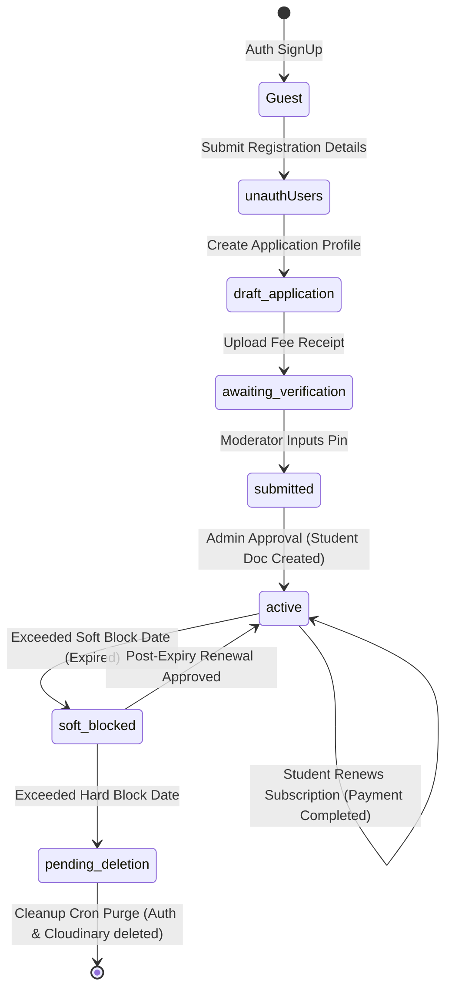
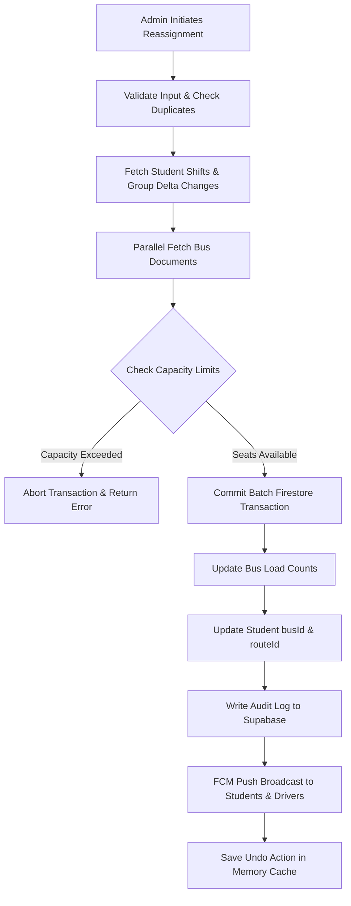
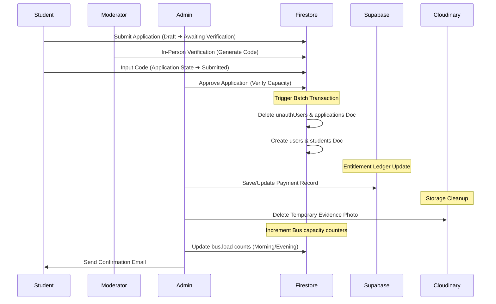

# ADTU ITMS — Consolidated System Reassignment and Student Lifecycle Technical Audit
### Consolidated Enterprise System Audit & Production Readiness Review
**File Path:** [SYSTEM_REASSIGNMENT_AND_STUDENT_LIFECYCLE_AUDIT.md](file:///C:/Users/ADMIN/Desktop/Projects/ITMS/SYSTEM_REASSIGNMENT_AND_STUDENT_LIFECYCLE_AUDIT.md)

---

## SECTION 1: EXECUTIVE SUMMARY

This section provides a high-level architectural overview of the Assam down town University (AdtU) Integrated Transit Management System (ITMS) based on a complete analysis of the codebase.

### 1.1 Current Reassignment Architecture
The reassignment architecture is divided into two modules:
1. **Manual Reassignment (`ReassignmentService` and `BusReassignmentServiceV2`):** Handles immediate student reassignment via Firestore Transactions. Reassignments are processed in batches of 80 to avoid Firestore limits. When students are moved:
   - Their student records are updated with the new `busId` and `routeId`.
   - The system calculates delta changes for the source and target buses and updates the per-shift counts (`load.morningCount` and `load.eveningCount`) and total members.
   - An undo history log is saved in memory with a 5-minute expiration window to allow rollbacks.
   - Reassignment actions are recorded Relational-style in the Supabase `reassignment_logs` table (and historically in Firestore's `activity_logs` which is now deprecated/blocked).
   - Push notifications are sent via Firebase Cloud Messaging (FCM) to the students and the destination drivers.
2. **Smart Allocation & Auto-Split System (`AllocationRanker` and `AutoSplitService`):** Suggests alternative buses when a primary bus is full. The `AutoSplitService` groups students by `(stopId, shift)` and distributes them across compatible buses using a multi-factor ranking scoring model (available seats, load reduction, stop proximity, shift compatibility).

### 1.2 Current Application Approval Architecture
The application approval architecture handles the transition of applicants from guest status to enrolled student status.
- **Workflow:** An application is submitted via the web client, transitioning from `draft` to `submitted`. A Moderator must verify the applicant in-person. A verification code is generated, sent to the moderator, and verified. 
- **Approval:** Once in `submitted` state, an Admin or Moderator invokes the `/api/applications/approve` (or `/approve-unauth`) API. The system:
  1. Verifies the approver's moderator permissions (`applications.canApprove`).
  2. Runs a capacity validation check (`validateAndSuggestBus`).
  3. Computes the academic session start/end years and block dates (`softBlock`, `hardBlock`).
  4. Records the payment transaction in the Supabase SQL database (immutable ledger).
  5. Performs a Firestore Batch write: creates the `users` and `students` documents, deletes the temporary `unauthUsers` document, and **deletes** the original application from the `applications` collection.
  6. Cloudinary payment receipts are deleted to save storage, and the bus load is incremented.

### 1.3 Current Student Lifecycle
The student lifecycle progresses through the following sequential states:
```
[Auth SignUp] ➔ [unauthUsers] ➔ [Application Draft] ➔ [Awaiting Verification] 
       ➔ [Verified & Submitted] ➔ [Approved ➔ Student Doc Created] ➔ [Active Student] 
       ➔ [Soft Blocked (Access Denied)] ➔ [Pending Deletion] ➔ [Hard Deleted (Purged)]
```
- **Auth SignUp / Guest:** Firebase Auth user record is created. Profile defaults to guest role.
- **unauthUsers Document:** Temporary registration metadata stored in `/unauthUsers/{uid}`.
- **Draft Application:** Temporary draft stored in `/applications/{applicationId}`.
- **Awaiting Verification:** The student has selected a route, uploaded payment proof (receipt), and requested verification. A Moderator is assigned.
- **Verified & Submitted:** Moderator inputs verification code. Application moves to the Admin Queue.
- **Approved / Active Student:** Application converted to `/students/{uid}`. Status is set to `'active'`.
- **Soft Blocked:** If a student fails to renew their subscription by the configured `softBlockDate`, their status changes to `'soft_blocked'`, blocking dashboard access while keeping their data.
- **Hard Deleted:** Two years after the session end year (or if validUntil is long past), the daily cleanup cron job cascades a purge of all records.

### 1.4 Current Capacity Management System
Bus capacities are cached in Firestore at the document level: `/buses/{busId}`.
- **Counter Schema:** The document includes `capacity` (max seats, default 55), `currentMembers` (total assigned), and `load` map:
  - `load.morningCount` (students on morning shift)
  - `load.eveningCount` (students on evening shift)
  - `load.totalCount` (synchronized with `currentMembers`)
- **Counter Mutations:** Counters are incremented by `incrementBusCapacity` (upon approval) and decremented by `decrementBusCapacity` (upon deletion/expiry) or updated via transactions in `ReassignmentService`.
- **Source of Truth vs. Derived Counters:** The counters stored in `/buses/{busId}` are **derived cache counters**. The absolute source of truth is the actual count of active student records in `/students` where `busId == busId` and `status == 'active'`.
- **Drift and Reconciliation:** Because updates occur across different APIs and batches, count drift can occur. The system implements a batch repair script `reconcileBusLoads` inside the reassignment service which resets all counters to match the student records.

### 1.5 Current Renewal Implementation Status
The system contains two parallel implementations for renewals:
1. **Legacy Offline Applications (`renewal_applications` collection):** Submitted by students via `/api/student/renew-application` for offline verification. This creates a pending document and flags the student document with `hasRenewalPending = true`. However, this collection is **NOT** defined in `firestore.rules`, blocking client-side reads.
2. **Production-Ready Renewal Requests (`renewal_requests` collection & Supabase):** Handles both online Razorpay transactions and offline cash payments.
   - For online mode: Razorpay orders are created via `/api/student/renew-service-v2`. Payment completion webhooks trigger the extension of the student's `validUntil` date.
   - For offline mode: A request document is created in `/renewal_requests/{requestId}`. Admins approve requests via `/api/renewal-requests/approve-v2`, updating the student document's `validUntil`, session years, and block dates, and writing to the Supabase transaction ledger.

### 1.6 Current Soft-Block Implementation Status
- **Status:** Fully Implemented.
- **Execution:** Governed by the daily automated cron job `/api/cron/cleanup-expired-students`.
- **Logic:** For each active student, it checks their computed or pre-stored `softBlock` date. If today is on or after that date, and no renewal transaction is logged, the document status is updated to `'soft_blocked'`. This denies access to the digital boarding QR pass.

### 1.7 Current Hard-Delete Implementation Status
- **Status:** Fully Implemented with strict safety guards.
- **Execution:** Triggered by `/api/cron/cleanup-expired-students` (secured by `CRON_SECRET` headers).
- **Purge Cascade:** If today is on or after the student's `hardBlock` date, the cron executes:
  1. Deletes the profile photo from Cloudinary.
  2. Deletes FCM tokens in `/fcm_tokens`.
  3. Deletes waiting flags in `/waiting_flags`.
  4. Deletes attendance records in `/attendance` (Supabase).
  5. Deletes profile update requests in `/profile_update_requests`.
  6. Decrements the assigned bus capacity in Firestore.
  7. Disconnects the Google auth provider (if any) and deletes the user record from Firebase Authentication.
  8. Deletes the student's documents from the `/students` and `/users` Firestore collections.
- **Safety Guards:** Hard delete is cancelled if the student has no `sessionEndYear`, if their `validUntil` is in the future, or if they have logged activity within the last 30 days.

---

## SECTION 2: COMPLETE FIRESTORE COLLECTION INVENTORY

This section details all collections present in the database, including fields, types, and security/business impact analysis.

### 2.1 Collection: `users`
- **Collection Path:** `/users/{userId}`
- **Purpose:** Enforces basic authentication metadata and role mapping.

| Field Name | Field Type | Nullable? | Required? | Default Value | Used By | Updated By | Security Risk | Business Impact |
| :--- | :--- | :--- | :--- | :--- | :--- | :--- | :--- | :--- |
| `uid` | String | No | Yes | None | Auth, API | Auth, API | Low | Critical |
| `email` | String | No | Yes | None | Auth, API | Auth, API | Medium (PII) | Critical |
| `role` | String | No | Yes | `'student'` | Security Auth | API | High (Escalation) | Critical |
| `name` | String | No | Yes | None | Dashboard | Client, API | Low (PII) | Medium |
| `createdAt` | String | No | Yes | None | Audit | Client, API | Low | Low |

- **Relationships:** Maps 1:1 with Firebase Auth records. Points to `students`, `drivers`, `moderators`, or `admins` collections based on the `role` field.
- **Indexes Required:** Single-field index on `uid` and `email` (for login lookups).
- **Rules Configured:** Read/write allowed for own UID. Role field is protected; only Admin role can write/modify it.

---

### 2.2 Collection: `students`
- **Collection Path:** `/students/{studentId}`
- **Purpose:** Primary registry for active students.

| Field Name | Field Type | Nullable? | Required? | Default Value | Used By | Updated By | Security Risk | Business Impact |
| :--- | :--- | :--- | :--- | :--- | :--- | :--- | :--- | :--- |
| `uid` | String | No | Yes | None | Core tracking | API | Low | Critical |
| `fullName` | String | No | Yes | None | Passes, UI | API, Client | Low (PII) | High |
| `email` | String | No | Yes | None | Admin UI, Auth | API | Medium (PII) | Critical |
| `phoneNumber` | String | Yes | Yes | None | Driver contact | API, Client | Medium (PII) | Medium |
| `enrollmentId` | String | No | Yes | None | Financial lookup | API | Low | Critical |
| `stopId` | String | No | Yes | None | Reassignments | API, Client | Low | Critical |
| `routeId` | String | No | Yes | None | Map track, Bus | API | Low | Critical |
| `busId` | String | No | Yes | None | Capacity, Passes | API | Low | Critical |
| `shift` | String | No | Yes | `'Morning'` | Counter sync | API | Low | Critical |
| `status` | String | No | Yes | `'active'` | Cron job, login | API | High | Critical |
| `validUntil` | String | No | Yes | None | Cron, login | API | High (Fraud) | Critical |
| `softBlock` | String | Yes | No | None | Cron, login | API | Medium | High |
| `hardBlock` | String | Yes | No | None | Cron, login | API | Medium | High |
| `paymentAmount` | Number | Yes | Yes | `0` | Audit | API | Low | Medium |
| `paid_on` | String/TS | Yes | Yes | None | Audit | API | Low | Medium |
| `profilePhotoUrl`| String | Yes | No | None | Passes | API, Client | Low (PII)| Medium |

- **Relationships:**
  - `busId` references `/buses/{busId}`.
  - `routeId` references `/routes/{routeId}`.
  - `stopId` references a stop object inside the corresponding route document.
- **Indexes Required:**
  - Composite: `status` Ascending + `busId` Ascending + `shift` Ascending.
  - Composite: `enrollmentId` Ascending + `status` Ascending.
- **Rules Configured:** Students can read only their own document. Drivers, moderators, and admins can read all student documents. Students cannot modify critical registration fields (like `validUntil` and `status`).

---

### 2.3 Collection: `applications`
- **Collection Path:** `/applications/{applicationId}`
- **Purpose:** Manages registration applications for new students.

| Field Name | Field Type | Nullable? | Required? | Default Value | Used By | Updated By | Security Risk | Business Impact |
| :--- | :--- | :--- | :--- | :--- | :--- | :--- | :--- | :--- |
| `applicationId` | String | No | Yes | None | Approval API | Client, API | Low | Critical |
| `applicantUid` | String | No | Yes | None | Security checks | Client, API | Low | Critical |
| `formData` | Map | No | Yes | None | Validation | Client, API | Medium (PII) | High |
| `state` | String | No | Yes | `'draft'` | Verification workflow| Client, API | High (Escalation) | Critical |
| `paymentEvidenceProvided`| Boolean| No | Yes | `false` | Moderator approval| Client, API | Medium (Fraud) | High |
| `verification` | Map | Yes | No | None | Verification code | Client, API | High (Bypass) | Critical |
| `approvedBy` | String | Yes | No | None | Audit | API | Low | Medium |
| `approvedAt` | String | Yes | No | None | Audit | API | Low | Medium |
| `auditLogs` | Array | No | Yes | `[]` | Audit history | API | Low | Medium |

- **Relationships:** `applicantUid` maps to a guest user in the `users` collection.
- **Indexes Required:** Index on `applicantUid` and `state`.
- **Rules Configured:** Students can read/write their own applications. Moderators and admins can read and update all applications.

---

### 2.4 Collection: `buses`
- **Collection Path:** `/buses/{busId}`
- **Purpose:** Enforces physical capacity limits and active driver tracking.

| Field Name | Field Type | Nullable? | Required? | Default Value | Used By | Updated By | Security Risk | Business Impact |
| :--- | :--- | :--- | :--- | :--- | :--- | :--- | :--- | :--- |
| `busId` | String | No | Yes | None | Core mapping | Client, API | Low | Critical |
| `busNumber` | String | No | Yes | None | Passes, UI | Client, API | Low | Medium |
| `capacity` | Number | No | Yes | `55` | Capacity checks | Client, API | Medium | Critical |
| `currentMembers` | Number | No | Yes | `0` | Capacity display | Client, API | Medium | Critical |
| `routeId` | String | Yes | No | None | Mapping | Client, API | Low | Critical |
| `shift` | String | No | Yes | `'Both'` | Shift logic | Client, API | Low | Critical |
| `status` | String | No | Yes | `'Active'` | Client UI | Client, API | Low | High |
| `load` | Map | No | Yes | `{ morningCount: 0, eveningCount: 0 }` | Seat verification | Client, API | High (Drift) | Critical |
| `activeDriverId` | String | Yes | No | None | Tracking | API | Medium | Critical |
| `assignedDriverId`| String | Yes | No | None | Default assignments | API | Low | Medium |
| `activeTripId` | String | Yes | No | None | Mutex trip locks | API | High (Mutex) | Critical |
| `activeTripLock` | Map | Yes | No | None | Heartbeat sweat | API | High (Lockout) | Critical |

- **Relationships:**
  - `routeId` references `/routes/{routeId}`.
  - `activeDriverId` / `assignedDriverId` reference `/drivers/{driverId}`.
- **Indexes Required:** Index on `routeId` and `status`.
- **Rules Configured:** Read allowed for all authenticated users. Writes restricted to moderators and admins. Client-side updates to lock-related fields (like `activeTripLock`) are blocked unless performed by the API service role.

---

### 2.5 Collection: `routes`
- **Collection Path:** `/routes/{routeId}`
- **Purpose:** Primary coordinate ledger for offline Guwahati vector maps.

| Field Name | Field Type | Nullable? | Required? | Default Value | Used By | Updated By | Security Risk | Business Impact |
| :--- | :--- | :--- | :--- | :--- | :--- | :--- | :--- | :--- |
| `routeId` | String | No | Yes | None | Mapping | Client, API | Low | Critical |
| `routeName` | String | No | Yes | None | UI | Client, API | Low | Medium |
| `status` | String | No | Yes | `'active'` | Visibility | Client, API | Low | Medium |
| `stops` | Array | No | Yes | `[]` | Proximity scoring | Client, API | Low | Critical |

- **Relationships:** Contains stop sub-objects. Points to `/buses` containing references to this `routeId`.
- **Indexes Required:** Index on `status`.
- **Rules Configured:** Read allowed for all. Writes restricted to moderators and admins.

---

### 2.6 Collection: `payments` (DEPRECATED IN FIRESTORE)
- **Collection Path:** `/payments/{paymentId}`
- **Purpose:** Obsolete collection. Blocked in security rules. All operations redirected to Supabase.
- **Security Risk:** High. Blocked to prevent data exposure.
- **Rules Configured:** `allow read, write: if false;`

---

### 2.7 Collection: `renewal_applications`
- **Collection Path:** `/renewal_applications/{applicationId}`
- **Purpose:** Holds student renewals waiting for verification.

| Field Name | Field Type | Nullable? | Required? | Default Value | Used By | Updated By | Security Risk | Business Impact |
| :--- | :--- | :--- | :--- | :--- | :--- | :--- | :--- | :--- |
| `studentId` | String | No | Yes | None | API | API | Low | High |
| `requestedDuration`| Number| No | Yes | None | API | API | Low | High |
| `sessionInfo` | Map | No | Yes | None | Date calculation | API | Low | High |
| `paymentStatus` | String | No | Yes | `'pending'` | Approvals | API | Medium | Critical |
| `status` | String | No | Yes | `'pending'` | Queue display | API | Medium | Critical |

- **Relationships:** `studentId` maps to `/students/{studentId}`.
- **Indexes Required:** Composite index on `studentId` + `status`.
- **Rules Configured:** **NOT IMPLEMENTED IN FIRESTORE RULES.** Defaults to global deny (read/write blocked to clients, accessible only via server-side Admin SDK).

---

### 2.8 Collection: `renewal_requests`
- **Collection Path:** `/renewal_requests/{requestId}`
- **Purpose:** Active queue of student renewal requests for approval.

| Field Name | Field Type | Nullable? | Required? | Default Value | Used By | Updated By | Security Risk | Business Impact |
| :--- | :--- | :--- | :--- | :--- | :--- | :--- | :--- | :--- |
| `studentId` | String | No | Yes | None | Verification | API | Low | High |
| `enrollmentId` | String | No | Yes | None | Financial audit | API | Low | Critical |
| `durationYears` | Number | No | Yes | None | Extensions | API | Low | High |
| `totalFee` | Number | No | Yes | None | Reconciliation | API | Low | Critical |
| `paymentId` | String | Yes | No | None | Supabase mapping | API | Medium | High |
| `status` | String | No | Yes | `'pending'` | Admin queues | API | Medium | Critical |

- **Relationships:** `studentId` references `/students/{studentId}`.
- **Indexes Required:** Index on `status`.
- **Rules Configured:** Students can read their own renewal requests. Admins and moderators can read and update all requests. Only admins can delete requests.

---

### 2.9 Collection: `untracked_students`
- **Collection Path:** `/untracked_students`
- **Status:** **NOT IMPLEMENTED / IMPLEMENTATION NOT FOUND**

---

### 2.10 Collection: `moderators`
- **Collection Path:** `/moderators/{moderatorId}`
- **Purpose:** Primary profile registry for moderators.

| Field Name | Field Type | Nullable? | Required? | Default Value | Used By | Updated By | Security Risk | Business Impact |
| :--- | :--- | :--- | :--- | :--- | :--- | :--- | :--- | :--- |
| `uid` | String | No | Yes | None | Auth checks | Client, API | Low | Critical |
| `fullName` | String | No | Yes | None | UI | Client, API | Low (PII) | Medium |
| `employeeId` | String | No | Yes | None | Approvals | Client, API | Low | Critical |
| `status` | String | No | Yes | `'active'` | Access verification| Client, API | High | Critical |

- **Relationships:** Maps 1:1 with `/users/{userId}` where role is `'moderator'`.
- **Indexes Required:** Index on `employeeId`.
- **Rules Configured:** Only admins can create or delete moderator profiles. Moderators can update only their own non-sensitive fields (excluding status/permissions).

---

### 2.11 Collection: `admins`
- **Collection Path:** `/admins/{adminId}`
- **Purpose:** Primary profile registry for administrators.
- **Fields:** `uid` (String), `email` (String), `name` (String).
- **Rules Configured:** Anyone authenticated can read. Writes restricted to admin users.

---

### 2.12 Collection: `verificationCodes`
- **Collection Path:** `/verificationCodes/{codeId}`
- **Purpose:** Holds transient verification PINs for moderator verification.
- **Fields:** `codeId`, `applicationId`, `studentUid`, `moderatorUid`, `codeHash`, `status` (`'pending'`), `attempts`, `maxAttempts`, `expiresAt`.
- **Rules Configured:** Students can read their own codes, moderators can read assigned codes. System/moderators can create and update them.

---

### 2.13 Collection: `waiting_flags`
- **Collection Path:** `/waiting_flags/{flagId}`
- **Purpose:** Real-time indicator for driver boarding alerts.
- **Fields:** `student_uid`, `student_name`, `bus_id`, `route_id`, `status` (`'raised'`), `trip_id`, `expires_at`.
- **Rules Configured:** Authenticated users can read active flags. Students can manage their own flags. Drivers can update flags for their assigned buses.

---

### 2.14 Collection: `activity_logs`
- **Collection Path:** `/activity_logs/{logId}`
- **Purpose:** General audit logs for administrator operations.
- **Fields:** `action`, `performedBy`, `targetId`, `details`, `timestamp`.
- **Rules Configured:** Only admins and moderators can read or create activity logs.

---

### 2.15 Collection: `adminActions`
- **Collection Path:** `/adminActions/{actionId}`
- **Purpose:** Administrative tracking with TTL rules.
- **Fields:** `actionType`, `actorUid`, `summary`, `timestamp`, `expiresAt`.
- **Rules Configured:** Only admins can read. Admins and moderators can create.

---

## SECTION 3: STUDENTS COLLECTION FULL ANALYSIS

### 3.1 Schema Definition
The `/students` collection contains documents representing approved and active students. The properties of each student document are:

```typescript
export interface Student {
  id: string;                                                         // Unique student record ID (maps to Firebase Auth UID)
  uid?: string;                                                       // Firebase Auth UID (redundant mapping)
  fullName: string;                                                   // Full name of the student
  email: string;                                                      // Assam down town University email address
  phoneNumber?: string;                                               // Mobile contact number of the student
  parentName?: string;                                                // Guardian full name
  parentPhone?: string;                                               // Guardian emergency phone number
  faculty?: string;                                                   // Academic faculty (e.g. Faculty of Computer Technology)
  department?: string;                                                // Specific department (e.g. Computer Science)
  semester?: string;                                                  // Current semester enrollment
  dob?: string;                                                       // Date of birth
  gender?: string;                                                    // Gender string
  bloodGroup?: string;                                                // Student blood group
  address?: string;                                                   // Residential address
  busId?: string;                                                     // Assigned bus document ID (e.g. "bus_6")
  routeId?: string;                                                   // Assigned route ID (e.g. "route_6")
  stopId?: string;                                                    // Assigned stop ID (e.g. "hatigaon")
  shift?: 'Morning' | 'Evening' | 'Morning & Evening';                // Assigned travel shifts (Note: Case-sensitive storage)
  status?: 'active' | 'soft_blocked' | 'pending_deletion';            // Status flag
  profilePhotoUrl?: string;                                           // Cloudinary image URL
  enrollmentId?: string;                                              // University Enrollment Code
  sessionStartYear?: number;                                          // Start year of active session (e.g. 2025)
  sessionEndYear?: number;                                            // End year of active session (e.g. 2026)
  validUntil?: string;                                                // ISO validity string (end of academic year validity)
  softBlock?: string;                                                 // Pre-stored soft block ISO date
  hardBlock?: string;                                                 // Pre-stored hard delete ISO date
  paymentAmount?: number;                                             // Last fee paid
  paid_on?: string;                                                   // Last fee payment timestamp
  hasRenewalPending?: boolean;                                        // True if renewal request is awaiting review
  renewalApplicationId?: string;                                      // Reference ID of pending renewal request
  computed?: {
    serviceExpiryDate?: string;                                       // Computed service end date
    renewalDeadlineDate?: string;                                     // Computed final renewal day
    softBlockDate?: string;                                           // Computed block day
    hardDeleteDate?: string;                                          // Computed deactivation day
    urgentWarningDate?: string;                                       // Computed warnings day
    computedAt?: string;                                              // Date calculated
    configVersion?: string;                                           // Used configuration document version
  };
}
```

### 3.2 Field Level Specifications
- **`uid` / `id`:** The Firebase Authentication UID. Created during signup and used as the document key. It is immutable and security-sensitive.
- **`validUntil`:** Calculated upon approval using the anchor month/day from `deadlineConfig`. It is security-sensitive and can only be updated by moderators or admins.
- **`softBlock` / `hardBlock`:** Computed block dates stored on the document for fast querying by the cron cleanup job. Updated during approval, renewal, or legacy migration.
- **`status`:** Core operational flag. Values: `'active'` (has tracking access), `'soft_blocked'` (boarding card denied, profile visible), `'pending_deletion'` (marked for cron deletion). It is security-sensitive and client modifications are blocked.

### 3.3 Student Lifecycle Diagram


---

## SECTION 4: APPLICATIONS COLLECTION FULL ANALYSIS

### 4.1 Schema Definition
The `/applications` collection manages the data structure for new registrants prior to onboarding.

```typescript
export interface Application {
  applicationId: string;                        // Unique application identifier
  applicantUid: string;                         // Guest Firebase Authentication UID
  applicantEmail?: string;                      // Student university email
  status: ApplicationStatus;                    // Draft, Awaiting Verification, Verified, Submitted, Approved, Rejected
  formData: {
    fullName: string;                           // Registrant's full name
    faculty: string;                            // Faculty name
    department: string;                         // Department name
    semester: string;                           // Current semester
    gender: string;                             // Gender
    dob: string;                                // Date of birth
    phone: string;                              // Contact phone number
    altPhone?: string;                          // Alternative phone number
    parentName: string;                         // Parent name
    parentPhone: string;                        // Parent contact
    enrollmentId: string;                       // Registration/Enrollment ID
    bloodGroup: string;                         // Blood Group
    address: string;                            // Home address
    routeId?: string;                           // Requested Route ID
    stopName?: string;                          // Requested Stop Name
    stopId?: string;                            // Requested Stop ID
    shift?: string;                             // Requested Travel Shift
    sessionInfo: {
      sessionStartYear: number;                 // Requested start year
      durationYears: number;                    // Session length (1-4 years)
      sessionEndYear: number;                   // Calculated end year
    };
    paymentInfo: {
      paymentMode: 'online' | 'offline';        // Selected payment method
      amountPaid: number;                       // Paid amount
      paymentReference?: string;                // UPI transaction ID (offline)
      paymentEvidenceUrl?: string;              // Cloudinary receipt URL (offline)
      razorpayPaymentId?: string;               // Transaction ID (online)
      razorpayOrderId?: string;                 // Order ID (online)
    };
  };
  verification?: {
    method: 'moderator_code';
    moderatorUID: string;                       // Assigned moderator's UID
    codeHash: string;                           // Secure hash of verification code
    verifiedAt?: Timestamp | string;            // Verification time
  };
  needsCapacityReview?: boolean;                // Flag indicating manual reassignment required
  reassignmentReason?: 'bus_full_only_option' | 'bus_full_alternatives_exist' | 'no_issue';
  hasAlternativeBuses?: boolean;                // Alternatives available flag
}
```

### 4.2 Lifecycle Transitions and Mutations
- **Creation:** Initiated by guests submitting registration forms, writing to `/applications/{applicationId}` in state `'draft'`.
- **Submission & Verification:** Transitioned to `'awaiting_verification'` when payment proof is uploaded. A verification code is sent to the assigned Moderator. Upon correct verification, state transitions to `'verified'` and then `'submitted'`.
- **Approval Flow:** The admin or moderator triggers `/api/applications/approve`. If capacity checks pass, the application document is **DELETED** from Firestore. A new student profile is created in `/students/{uid}`.
- **Rejection Flow:** Triggered via `/api/applications/reject`. Cloudinary files (profile photo and payment receipt) are deleted. The application document is **DELETED** from Firestore, and a rejection notification email is sent.

---

## SECTION 5: BUSES COLLECTION FULL ANALYSIS

### 5.1 Bus Count Logic
The `/buses` collection contains physical attributes and operational capacities for each vehicle.

```typescript
export interface Bus {
  busId: string;                                // Document ID (e.g. "bus_1")
  busNumber: string;                            // Plate Number (e.g. "AS-01-PC-9094")
  capacity: number;                             // Physical seat limit (usually 55)
  currentMembers: number;                       // Total active students assigned
  routeId: string;                              // Associated route ID
  shift: 'Morning' | 'Evening' | 'Both';        // Vehicle shift schedule
  load: {
    morningCount: number;                       // Student count for morning shift
    eveningCount: number;                       // Student count for evening shift
    totalCount: number;                         // Total combined active count
  };
  activeDriverId?: string;                      // Current driver UID
  assignedDriverId?: string;                    // Default scheduled driver UID
  activeTripId?: string | null;                 // Active trip ID (mutex lock)
  activeTripLock?: {
    active: boolean;                            // True if bus is operating a trip
    driverId: string;                           // Operating driver
    expiresAt: string;                          // Lock expiry timestamp
  };
}
```

### 5.2 Seat Availability and Drift Analysis
- **Count Calculation:** Counts are updated on state changes:
  - `incrementBusCapacity` adds `+1` to `currentMembers`, `load.totalCount`, and either `load.morningCount` or `load.eveningCount` depending on the student's shift.
  - `decrementBusCapacity` subtracts `-1` similarly.
  - `executeManualReassignment` updates delta changes on both source and destination vehicles.
- **Drift Risk:** Since these counters are updated through multiple distributed API endpoints, they can fall out of sync due to:
  1. Failed updates or transaction timeouts.
  2. Bypassed validation rules during manual edits in the Firebase console.
  3. Student deletions that fail to decrement the bus capacity counter.
- **Reconciliation Script:** The `reconcileBusLoads` batch script runs in `BusReassignmentServiceV2`. It queries all active student records, groups them in memory by `busId` and `shift`, and overwrites the bus load counters to match the student records.

---

## SECTION 6: CURRENT REASSIGNMENT & DRIVER CONTROL SYSTEMS

### 6.1 Process Flow of `reassignment-service.ts`
The manual reassignment system handles moving students from one bus to another.



### 6.2 Implementation Details
- **Transaction Atomicity:** Reassignments run inside a Firestore `runTransaction` loop. It reads all affected bus documents before writing, ensuring capacities do not exceed limits during concurrent updates.
- **Batching:** Operations are chunked into groups of 80 to prevent Firestore transaction timeouts.
- **Undo History:** Keeps up to 10 entries in `undoHistory` for 5 minutes. Reversing a plan swaps the source and target buses and executes a transaction update.
- **Auditing:** Writes changes to Supabase's `reassignment_logs` via the `/api/reassignment-logs` endpoint.

### 6.3 Driver Swap System & Relational Integration
The `DriverSwapSupabaseService` (`src/lib/driver-swap-supabase.ts`) handles temporary interchanges of bus control assignments between active drivers, and temporary allocations to reserved drivers:

- **State Transitions:**
  - `pending` (Default state upon creation. Expires automatically in 20 minutes if not accepted).
  - `accepted` (Accepted by the candidate driver. Triggers temporary assignment in Supabase and ownership transfer in Firestore).
  - `rejected` (Declined by the candidate driver. Sends notification back to requester).
  - `cancelled` (Cancelled by the requesting driver before response).
  - `expired` (Updated by housekeeping cron when `expires_at < NOW()`).
  - `pending_revert` (Triggered when a swap ends but one or both buses have active trip sessions in progress).
- **Mutations on Acceptance:**
  1. Updates request state to `accepted` in Supabase table `driver_swap_requests`.
  2. Creates a row in `temporary_assignments` specifying `bus_id`, `original_driver_uid`, `current_driver_uid`, `route_id`, and validity period.
  3. If the swap starts immediately, performs a Firestore transaction writing directly to `buses/{busId}`: updates `activeDriverId` and `assignedDriverId` to the candidate driver. Also updates target documents in `/drivers` collection (swapping `assignedBusId`, `busId`, `assignedRouteId`, `routeId` values).
  4. If configured, updates the active Firestore document `/trip_sessions/{tripId}` with the new driver details.
  5. Sends multicast FCM push notification to all students assigned to the bus, notifying them of the driver change.
- **Reversion and Revert Mutex Lock:**
  - When `endSwap()` is triggered (manually or via cron): the system checks if the bus is currently on a trip by querying Supabase `bus_locations` for active flags and checking the Firestore `activeTripId` lock.
  - If a trip is active, the status transitions to `pending_revert`. Ownership in Firestore remains with the candidate driver.
  - The system checks both buses in true driver-to-driver swaps. If only one bus has completed its trip, the system performs a **partial revert**: the driver whose trip ended is set to `reserved` status in Firestore (their bus assignment is cleared), while the other driver retains control until their trip ends.
  - Once all trip active locks are cleared, `endSwap()` deletes the row from `temporary_assignments`, deletes the request from `driver_swap_requests`, and restores the original drivers' mappings in the Firestore `buses` and `drivers` collections.

### 6.4 Active Trip Locks (`TripLockService`)
Enforces exclusive operation to prevent split telemetry issues:
- **Lock Acquisition:** Before beginning a trip, the driver acquires an exclusive lock via a Firestore transaction on `/buses/{busId}`.
- If `activeTripLock.active == true` and not expired, the request is rejected with `LOCKED_BY_OTHER`.
- If unlocked, the transaction writes driver info to `activeTripLock`, sets `active = true`, and sets `expiresAt` (now + 5 minutes).
- **Supabase Active Trips Insertion:** Upon successful Firestore lock acquisition, the API inserts a row in Supabase's `active_trips` table with `status = 'active'`. If the database write fails, the Firestore lock is rolled back.
- **Heartbeat & Throttle:** While the trip is active, the driver app pings `/api/driver/heartbeat` to extend the lock's `expiresAt` timestamp in Firestore. To minimize Firestore write billing, heartbeats are throttled in memory using `heartbeatWriteCache` to run at most once every 20 seconds.
- **Auto-Release Cron:** Every 60 seconds, `/api/cron/cleanup-stale-locks` pings the server. It checks if the `last_heartbeat` in Supabase is older than 5 minutes. If stale, the cron marks the trip as `ended` in Supabase and resets the Firestore `activeTripLock` fields to `active = false` and `tripId = null`.

---

## SECTION 7: CURRENT STUDENT APPROVAL WORKFLOW



### 7.1 Database Mutations on Approval
1. **Firestore - `/applications/{appId}`:** Document **DELETED**.
2. **Firestore - `/unauthUsers/{uid}`:** Document **DELETED**.
3. **Firestore - `/users/{uid}`:** Document **CREATED** with fields: `createdAt`, `email`, `name`, `role: 'student'`, `uid`.
4. **Firestore - `/students/{uid}`:** Document **CREATED** with student attributes, including calculated `softBlock` and `hardBlock` dates.
5. **Firestore - `/buses/{busId}`:** The `load.morningCount` or `load.eveningCount` counter is incremented, and `currentMembers` / `load.totalCount` is updated.
6. **Supabase - `payments` table:** Updates payment status to `'Completed'` and updates validity parameters.

---

## SECTION 8: CAPACITY MANAGEMENT SYSTEM

### 8.1 Shift-Based Capacity Formulas
For any bus $B$:
- Max Capacity: $C_B$
- Morning Count: $M_B$
- Evening Count: $E_B$

$$\text{Available Seats}_{\text{Morning}} = C_B - M_B$$

$$\text{Available Seats}_{\text{Evening}} = C_B - E_B$$

$$\text{Load Percentage}_{\text{Morning}} = \left( \frac{M_B}{C_B} \right) \times 100$$

$$\text{Load Percentage}_{\text{Evening}} = \left( \frac{E_B}{C_B} \right) \times 100$$

### 8.2 Capacity Impact Rules
- **Manual Reassignment:** For a student with shift $S$ moving from bus $X$ to $Y$:
  - $X$ load is decremented: $Count_{X, S} \leftarrow Count_{X, S} - 1$
  - $Y$ load is incremented: $Count_{Y, S} \leftarrow Count_{Y, S} + 1$
- **Onboarding Approval:** Increments the assigned bus capacity: $Count_{\text{Bus}, S} \leftarrow Count_{\text{Bus}, S} + 1$.
- **Hard Delete Purge:** Decrements the assigned bus capacity: $Count_{\text{Bus}, S} \leftarrow \max(0, Count_{\text{Bus}, S} - 1)$.

---

## SECTION 9: AUTO ASSIGNMENT SYSTEM

### 9.1 Suggester Engine Algorithm
The suggester engine handles routing and bus recommendations.
1. **Bus Search:** Filters buses in the database to find those serving the student's stop that match their shift (e.g. Morning student matches Morning or Both bus shifts).
2. **First Reassign Click Logic:** Evaluates three scenarios:
   - **Case 1 (Primary Bus Full + No Alternatives):** Returns `canAssign = false` and `requiresAdminAttention = true`. Dispatches a high-demand alert notification to all admins.
   - **Case 2 (Primary Bus Full + Alternatives Available):** Returns `canAssign = false` and lists alternative buses sorted by seat availability. The admin must manually select the target vehicle.
   - **Case 3 (Seats Available):** Returns `canAssign = true` and suggestions. The student is assigned to their primary bus.
3. **Reassignment Tabs:**
   - **Current/Same Stop:** Filters buses that stop at the student's exact stop.
   - **Other Buses:** Lists all active buses in the system, sorted by capacity.

### 9.2 Ranking & Scoring Logic
For each candidate bus, `AllocationRanker` scores the option using:
1. **Seat Availability ($S_{\text{seat}}$ - 50%):** Ratio of remaining seats to bus capacity.
2. **Stop Proximity ($S_{\text{stop}}$ - 30%):** Measures stop sequence proximity compared to the original route.
3. **Shift Match ($S_{\text{shift}}$ - 15%):** Scores how well shifts align (1.0 for exact, 0.75 for partial matching).
4. **Load Reduction ($S_{\text{load}}$ - 5%):** Penalizes candidate buses if they exceed a 90% load threshold after assignment.

$$\text{Score} = (0.5 \times S_{\text{seat}}) + (0.3 \times S_{\text{stop}}) + (0.15 \times S_{\text{shift}}) + (0.05 \times S_{\text{load}})$$

### 9.3 Suggester Engine Pseudocode
```python
def check_suggester_engine(student_stop_id, student_shift, requested_route_id):
    primary_bus_id = requested_route_id.replace("route_", "bus_")
    bus_ref = get_firestore_document("buses", primary_bus_id)
    
    # Check if primary bus has seats
    current_shift_members = bus_ref.load.morningCount if student_shift == "Morning" else bus_ref.load.eveningCount
    if current_shift_members < bus_ref.capacity:
        return { "can_assign": True, "target_bus": primary_bus_id }
        
    # Primary bus is full, search alternatives
    alternative_buses = []
    all_buses = query_firestore_collection("buses")
    for bus in all_buses:
        if bus.bus_id == primary_bus_id:
            continue
        if not is_shift_compatible(student_shift, bus.shift):
            continue
        if not has_stop(bus.route.stops, student_stop_id):
            continue
            
        free_seats = bus.capacity - (bus.load.morningCount if student_shift == "Morning" else bus.load.eveningCount)
        if free_seats > 0:
            alternative_buses.append(bus)
            
    if len(alternative_buses) > 0:
        # Sort alternatives by available seats descending
        alternative_buses.sort(key=lambda b: b.free_seats, reverse=True)
        return { "can_assign": False, "alternatives": alternative_buses }
        
    # No alternatives found, send alert to admins
    trigger_high_demand_alert(requested_route_id, student_stop_id)
    return { "can_assign": False, "requires_admin_attention": True }
```

---

## SECTION 10: EXHAUSTIVE CASE ANALYSIS (CURRENT IMPLEMENTATION)

### 10.1 CASE 1: Primary Bus Full + No Alternatives
- **Scenario:** Student selects Route-6 (Bus-6). Bus-6 has reached full capacity. No other buses serve their selected stop.
- **Code Path:**
  - `validateAndSuggestBus` gets details for Bus-6.
  - `checkBusCapacity` returns `available = false`.
  - `findAlternativeBuses` queries all buses, but none match the stop.
  - `sendHighDemandAlert` is triggered, writing a critical notification to the Firestore collection.
- **Outcome:** The API returns a 400 error status: `"Bus is at full capacity"`. The user is blocked from completing registration.
- **Risk Analysis:** Students are left stranded without transport options, requiring administrators to manually resolve the capacity bottleneck.

### 10.2 CASE 2: Primary Bus Full + Alternatives Available
- **Scenario:** Student selects Route-6 (Bus-6). Bus-6 is full, but Bus-1 also serves their selected stop and has available seats.
- **Code Path:**
  - `validateAndSuggestBus` gets details for Bus-6.
  - `checkBusCapacity` returns `available = false`.
  - `findAlternativeBuses` finds Bus-1, verifies shift compatibility, and confirms available seats.
  - Returns `canAssign = false` and lists Bus-1 as an alternative.
- **Outcome:** The application is marked with `needsCapacityReview = true` and `reassignmentReason = 'bus_full_alternatives_exist'`. The student is placed in the admin review queue.
- **Risk Analysis:** Student onboarding is delayed until an administrator manually assigns them to the alternative bus.

### 10.3 CASE 3: Seats Available on Primary Bus
- **Scenario:** Student selects Route-6 (Bus-6), and seats are available.
- **Code Path:**
  - `validateAndSuggestBus` gets details for Bus-6.
  - `checkBusCapacity` returns `available = true`.
- **Outcome:** The application is processed, transitioning the status to active and assigning them to Bus-6.
- **Risk Analysis:** Low risk. Normal operational path.

---

## SECTION 11: PROPOSED NEXT-YEAR ADMISSION MODEL

This section evaluates the impact of supporting student registrations for a new academic year while the current year is still active.

### 11.1 System Bottlenecks
1. **Overlap in Validity:** If the system config is updated for the new year, active students from the current year may be soft-blocked prematurely.
2. **Capacity Overlaps:** Current year student counts and new year applicant counts will overwrite the same `/buses` load counters, causing capacity drift.
3. **Hardcoded Year Calculations:** Core date logic derives anchor dates using the student's `sessionEndYear`. If a student registers early, calculations will overlap.

### 11.2 Proposed Architecture Modification
- **Firestore - `/buses`:** Refactor the `load` schema to track counts by academic year:
  ```json
  "load": {
    "2025-2026": { "morningCount": 15, "eveningCount": 12 },
    "2026-2027": { "morningCount": 4, "eveningCount": 0 }
  }
  ```
- **APIs:** Modify `/api/applications/approve` to query capacity based on the target academic year.
- **Supabase payments:** Add a required `academic_year` text column (e.g. `'2025-2026'`) to separate payments across sessions.

---

## SECTION 12: SOFT BLOCK REDESIGN ANALYSIS

This section analyzes the impact of updating capacity counts when a student is soft-blocked.

### 12.1 Impact Analysis
Currently, a soft-blocked student remains assigned to their bus and is included in the capacity count. If capacity counts are updated to exclude soft-blocked students, seats will free up for new registrants.

### 12.2 Risk Assessment
- **Race Condition:** If a soft-blocked student renews after their seat is allocated to a new registrant, the bus will become overloaded.
- **Count Drift:** Toggling counts during block/unblock actions increases the risk of counter errors.
- **Mitigation:**
  - Implement a "Hold Period" (e.g. 15 days) after a soft block before freeing the seat.
  - Run the `reconcileBusLoads` script automatically after executing blocks.

---

## SECTION 13: RENEWAL APPLICATION SYSTEM DESIGN

### 13.1 Collection Schema: `/renewal_applications`
Proposed schema for managing student subscription renewals:

```json
{
  "applicationId": "renew_1767110589_ABC",
  "studentId": "6oQXSXaHiYcZ5aq6sVKWPuiJIHk1",
  "studentName": "Dhiman Saikia",
  "enrollmentId": "ADTU/0/2024-28/BCSM/29",
  "email": "student@adtu.in",
  "paymentInfo": {
    "paymentMode": "offline",
    "amountPaid": 5000,
    "paymentReference": "UPI90987116",
    "paymentEvidenceUrl": "https://cloudinary.com/..."
  },
  "requestedDuration": 1,
  "status": "pending",
  "createdAt": "2026-06-22T21:36:00Z"
}
```

- **Required Indexes:** Composite index on `studentId` and `status`.
- **Workflow:** Students submit a renewal application. A moderator verifies the payment proof and approves the request, which extends the student's `validUntil` date and updates their status to active.

---

## SECTION 14: UPCOMING STUDENTS SYSTEM DESIGN

### 14.1 Collection Schema: `/untracked_students`
Tracks students who are pre-approved but have not completed registration:

```json
{
  "enrollmentId": "ADTU/NEW/2026/001",
  "fullName": "Hayato",
  "email": "hayato@gmail.com",
  "isVerified": false,
  "allowApproval": false,
  "validUntil": "2026-07-01T00:00:00Z",
  "renewalYear": 2027,
  "metadata": {
    "source": "academic_office_import",
    "importedAt": "2026-06-20T10:00:00Z"
  }
}
```

- **Workflow:** The academic office imports upcoming student records. When a student signs up, the system matches their email, imports their details, and prompts them to complete payment and choose a route.

---

## SECTION 15: APPLICATION PAGE REDESIGN

### 15.1 UI Structure
- A tabbed dashboard layout separating applications into **Freshers**, **Renewals**, and **Upcoming**.
- Include inline capacity meters showing vehicle seat utilization (e.g. `[||||||||  ] 80%`).
- Display conflict warnings (e.g., `'Student Stop Mismatch'`).

### 15.2 Database Queries
- Query Freshers:
  `collection('applications').where('state', '==', 'submitted')`
- Query Renewals:
  `collection('renewal_requests').where('status', '==', 'pending')`
- Query Upcoming:
  `collection('untracked_students').where('isVerified', '==', false)`

---

## SECTION 16: REASSIGNMENT FROM APPLICATION PAGE

Evaluating the impact of allowing admins to reassign student bus/route assignments *before* the application is approved.
- **Database Impact:** Minimal. Changes are written to the application draft document instead of the student document.
- **Security Impact:** Low risk. No write access is required on active student collections.
- **Capacity Impact:** Temporary holds must be placed on the target bus to prevent over-allocation.
- **Permissions:** Restricted to roles with `applications.canApprove` and `students.canReassign` permissions.

---

## SECTION 17: ALL EDGE CASES

### 17.1 Application Approval Conflicts
1. **Double Approval:** Two administrators approve the same application concurrently. The first transaction deletes the document, causing the second to fail with a `Document Not Found` error.
2. **Approval During Rejection:** An admin approves an application while a moderator rejects it. The rejection deletes the payment proof from Cloudinary, leaving the approved student profile without documents.
3. **Approval on a Deleted Bus:** An admin approves an application assigned to Bus-1, but the bus was deleted. The transaction throws a `Bus Not Found` error and rolls back.
4. **Incorrect Shift Input:** Student selects a Morning shift, but is assigned to an Evening-only bus. The capacity check fails or registers incorrect shift load counts.
5. **Approval with Expired Document Signature:** During verification, the RSA receipt signature check fails because public keys were updated, aborting onboarding.
6. **Concurrent User Creation:** Firebase Auth user is created, but Firestore batch write fails. The auth record is orphaned, blocking registration attempts.
7. **Cloudinary Asset Upload Interruption:** Profile image upload to Cloudinary completes, but client crashes before submitting the form. Orphaned assets remain in storage.
8. **Moderator PIN Exhaustion:** A student inputs the moderator verification PIN incorrectly 5 times. The code status changes to `failed` and blocks further inputs until reset.
9. **Duplicate Enrollment ID Approval:** Admin attempts to approve two different applications possessing the same `enrollmentId`. The second transaction aborts due to index uniqueness check in Supabase payments.
10. **Session End Year Mismatch:** Student inputs duration as 2 years but sessionInfo calculates end year as 1 year. The approval transaction throws a date calculation error.

### 17.2 Concurrency & Race Conditions
11. **Simultaneous Swaps:** Two drivers request to swap buses concurrently. Relational integrity checks fail, or both are assigned to the same bus.
12. **Reassignment and Approval:** A student application is approved while a bulk reassignment is running. The bus load counter is updated twice, causing count drift.
13. **Heartbeat Mutex Conflict:** A driver attempts to start a trip on a bus while another driver's heartbeat lock is expiring. A race condition occurs during the transition.
14. **Double Offline Payment Submission:** A student clicks submit twice on an offline payment form. Two pending transactions are created with different IDs.
15. **Driver Heartbeat Network Drop:** Telemetry update is sent during a network disconnection. The server detects a timeout and releases the lock while the driver continues operating.
16. **Concurrent Heartbeat and Revert:** A driver pings the heartbeat API while the admin reverts their swap. The heartbeat extends the lock, contradicting the reversion.
17. **Duplicate Razorpay Webhook Event:** Razorpay dispatches two webhook events for the same completed transaction. The duplicate execution is blocked by the Supabase unique constraint.
18. **Simultaneous Batch Reassignments:** Two administrators run bulk reassignments on overlapping student cohorts. The second transaction rolls back due to concurrent mutations.
19. **Waiting Flag Acknowledgment Race:** A student cancels their waiting flag at the exact millisecond the driver clicks to acknowledge it, resulting in a status error.
20. **Map Telemetry Message Order:** High-frequency GPS telemetry packets are received out of chronological order. The client map interpolation jerks backward.

### 17.3 Expiry & Cron Deletions
21. **Deletion of Active User:** A student logs in while the cleanup cron is running. The cron deletes their document, causing their session to expire.
22. **Grace Period Renewal:** A student renews their subscription during the 30-day deletion grace period. The cron fails to detect the update and deletes the account.
23. **Google Auth Provider Disconnection Failure:** A Google-linked student account is deleted, but provider disconnection fails. The student is blocked from registering again.
24. **Missing validUntil Date:** A student document lacks a `validUntil` date. The cron skips deletion to prevent purging incomplete profiles.
25. **FCM Token Purge Failure:** The cron deletes the student document but Firestore rules or timeouts fail to delete the FCM token, leaving orphaned tokens.
26. **Stale Lock Over-Deletion:** Stale lock cleanup cron runs during a GPS update delay, releasing the lock while the bus is in motion.
27. **Cloudinary API Rate Limit Exhaustion:** During bulk deletions, Cloudinary's daily API quota is exceeded. Orphaned assets remain in storage.
28. **Incomplete Cascade Purge:** The cron deletes the auth record but fails to delete the student document due to database timeout, leaving orphaned profiles.
29. **Deleted Student Attendance Lookup:** A driver attempts to query attendance logs for a student who was hard-deleted, throwing a database lookup error.
30. **Re-registration after Hard Delete:** A hard-deleted student attempts to sign up again. The system blocks them if their Firebase Auth record was not completely purged.

### 17.4 Capacity & Count Drift
31. **Manual Capacity Edits:** An admin edits a student's `busId` in the Firebase Console. The bus capacity counter does not update, leading to count drift.
32. **Overload on Multi-Shift Buses:** A bus is marked as Both shifts. The morning shift is full, but the evening shift has seats. A student is assigned to the evening shift, but the system rejects it because it checks total capacity instead of shift capacity.
33. **Reconciliation Failure:** The reconciliation script times out due to a high volume of student records, leaving counters out of sync.
34. **Incorrect Shift Delta Updates:** A student is moved from a Morning shift to an Evening shift. The system decrements the morning counter but fails to increment the evening counter.
35. **Capacity Adjustment on Inactive Bus:** Admin updates a bus capacity in the console while the bus status is set to `'inactive'`. Onboarding validation fails to read the document.
36. **Auto-Suggest Threshold Overrun:** Scored buses are near 89.9% capacity. Two concurrent students are auto-assigned to the same bus, pushing the load to 92%.
37. **Student Status Modification In Firebase Console:** Changing status from `'active'` to `'suspended'` does not update bus load counts, causing discrepancy.
38. **Zero Capacity Configuration:** A bus is configured with `capacity = 0`. The suggester engine crashes due to a divide-by-zero error.
39. **Multi-Stop Sequence Proximity Tie:** Two candidate buses score exactly the same. The suggester engine selects the first, causing uneven distribution.
40. **Draft Application Holds:** Multiple draft applications place temporary reservations on seats. The drafts are abandoned, but seats remain locked.

### 17.5 External System Failures
41. **Razorpay Webhook Delay:** A student completes payment, but the webhook is delayed. The student is soft-blocked before the transaction is recorded.
42. **Cloudinary Asset Deletion Failure:** An application is rejected, but Cloudinary API limits block asset deletion. Orphaned images remain on the server.
43. **FCM Topic Registration Timeout:** A driver starts a trip, but topic registration fails. Students do not receive the departure alert.
44. **Google Maps API Limit Reached:** The system fails to load maps because the API quota is exceeded.
45. **OpenRouteService (ORS) API Offline:** ORS geometry calls fail. The map cannot render route vector lines, crashing the driver telemetry screens.
46. **SMTP Email Delivery Timeout:** Resend email pipeline times out during approval, blocking the transaction from completing.
47. **Firebase Auth Token Verification Outage:** Firebase Auth servers are temporarily down. Users are blocked from accessing dashboards.
48. **Supabase Replication WAL Lag:** High GPS write frequency causes Postgres WAL replication lag. Telemetry updates on the student map are delayed.
49. **PWA Offline Sync Conflict:** A driver collects scans offline. Upon reconnecting, the offline scans sync out of chronological order, throwing validation warnings.
50. **Google Provider Token Revocation Failure:** Admin deletes a user account but Google OAuth token remains valid on the client browser.

---

## SECTION 18: PRODUCTION-GRADE RECOMMENDATIONS

### 18.1 Must Fix Before Launch (Critical)
1. **Dead Security Proxy (`src/proxy.ts`):** Next.js ignores `proxy.ts`. Rename the file to `middleware.ts` to enable rate-limiting, CSRF protection, and path blocking.
   - *Reason:* Bypasses all client-side security guards.
   - *Risk:* High.
   - *Complexity:* Low.
2. **Broken Boarding verification:** Update verification endpoints to write scan records to the database.
   - *Reason:* Renders the scan history table useless.
   - *Risk:* High.
   - *Complexity:* Medium.
3. **Insecure Trip IDs:** Replace `Math.random()` with `crypto.randomUUID()` to prevent key collisions.
   - *Reason:* Predictable IDs are vulnerable to enumeration attacks.
   - *Risk:* Medium.
   - *Complexity:* Low.
4. **Mock Distance Calculation:** Update the location upload API to use the Haversine formula instead of `Math.random() * 5` to enable location spoofing detection.
   - *Reason:* Breaks spoof detection.
   - *Risk:* High.
   - *Complexity:* Low.

### 18.2 Should Fix (Medium Priority)
5. **Stale Lock cron:** Increase cleanup frequency to prevent buses from being locked when drivers disconnect.
   - *Risk:* Medium.
   - *Complexity:* Low.
6. **Firestore Rules for Renewals:** Add rule definitions for the `renewal_applications` collection.
   - *Risk:* Medium.
   - *Complexity:* Medium.

### 18.3 Nice To Have (Low Priority)
7. **Heartbeat Throttling:** Throttle driver updates when the vehicle is stationary.
   - *Risk:* Low.
   - *Complexity:* Medium.
8. **Map Provider Fallback:** Implement automatic fallback to offline MapLibre maps if Google Maps fails to load.
   - *Risk:* Low.
   - *Complexity:* Medium.
